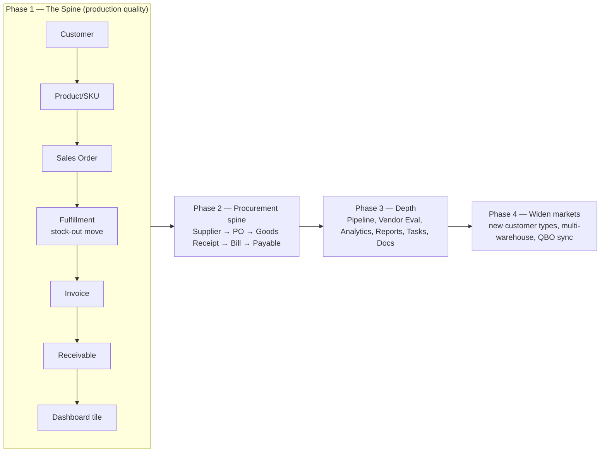

# ApexOS — Product Requirements Document

> **Status:** Draft for build · **Owner:** Product · **Version:** 1.0 · **Date:** 2026-07-19
>
> Conforms to `00-canonical-foundation.md`. Where this document and the canonical foundation
> disagree, **the foundation wins**. Decisions referenced as **D1–D10**; entity names are canonical.

---

## 1. Vision & Problem Statement

### Vision
ApexOS is the **internal operating system** for **Apex Supply Solutions Pvt. Ltd.** — one screen
where the founder and team run the entire business: what a customer ordered, what stock moved, what
was invoiced, what is owed, and **what to do next**. Not an ERP clone, not a SaaS product — bespoke
software that models Apex's business exactly.

### Problem
Apex today runs on a 23-sheet spreadsheet blueprint (`Apex_Operating_System_Master_v1.xlsx`).
Spreadsheets cannot enforce the things that matter to a procurement business:

| Pain | Consequence today |
|---|---|
| No append-only ledgers | Stock and cash balances are overwritten; no audit trail, no truth over time. |
| Prices not versioned | Buy/sell price history is lost; margin cannot be reconstructed. |
| No credit enforcement | A customer over their credit limit is only caught by eye. |
| Manual reconciliation | Sales order → invoice → receipt is stitched by hand across sheets. |
| No "what needs attention" | Low stock, overdue receivables, and stalled leads surface only when someone looks. |
| No roles or audit | Everyone edits everything; no record of who changed what. |

### Why now
Apex is entering its first market (**HoReCa**) with a defined SKU catalogue across **9 categories**,
two house brands (**Aura**, **Apex**), four **procurement models**, and two **supplier types**. The
business rules are known and stable enough to encode — and encoding them now, spine-first (**D4**),
is cheaper than encoding them after scale.

---

## 2. Goals & Non-Goals

### Goals
1. **One command center.** Every page answers *What happened? · What needs attention? · What should I do?*
2. **A correct financial and stock spine.** Append-only ledgers (**D3**), money as integer paise (**D5**),
   GST-aware from day one (**D9**).
3. **Spine-first to production (D4):** `Customer → Product → Sales Order → Fulfillment → Invoice →
   Receivable → Dashboard tile` — one vertical slice, production quality, before widening.
4. **Data-driven nouns (D2).** Customer types, supplier types, categories, UOMs, procurement models,
   tax rates, warehouses are editable rows — never hardcoded. **Nothing hardcoded to restaurants.**
5. **Auditability for 20 years.** Full audit columns (**D7**), an `activity_log` for every domain event
   (**D10**), soft-delete everywhere.
6. **Margin visibility.** Versioned buy and sell prices → GP per line and aggregated, as a first-class KPI.

### Non-Goals (v1)
- **Not** a multi-tenant SaaS. Single-tenant with **Business Unit** as a first-class dimension (**D1**).
- **Not** a general ERP; no manufacturing/MRP, no HR/payroll beyond what QuickBooks provides.
- **No** customer-facing storefront or portal in v1 (internal team only, Clerk auth — **D8**).
- **No** promotion of workflows to config until a **second real variant** appears (**D2**).
- **No** mobile-native app in v1 (responsive web is in scope).
- **No** custom general ledger — QuickBooks Online is the candidate system-of-record bridge for Finance.

---

## 3. Personas

| Persona | Role in Apex | Primary jobs | What ApexOS gives them |
|---|---|---|---|
| **Founder / COO** | Runs the company | See health at a glance; decide procurement & pricing; unblock the team | Dashboard (00/18/19), margin, receivables, low-stock, "what to do next" feed |
| **Sales Rep** | Owns customers & pipeline | Onboard customers, capture orders, chase leads | Customers, Credit Policy, Sales Orders, Sales Pipeline, Selling Price |
| **Procurement Officer** | Sources product | Manage suppliers, raise POs, hold buy prices, evaluate vendors | Suppliers, Purchase Orders, Purchase Price, Vendor Evaluation, Procurement Strategy |
| **Warehouse Op** | Moves stock | Receive goods, fulfil orders, keep inventory true | Warehouse, Inventory, Goods Receipt, Fulfillment, low-stock alerts |
| **Finance / Accounts** | Owns the money | Issue invoices, record payments, manage AR/AP, GST | Invoices, Bills, Payments, Receivables/Payables, Finance Dashboard, QBO bridge |
| **Admin** | Owns configuration | Manage users/roles, master data, settings | Settings (types, tax rates, warehouses), Users & Roles, Documents |

> Personas map to **roles** (`role`, `permission`, `role_permission`, `user_role`). One person may hold
> several roles at Apex's current size; authorization is ours (**D8**), auth is Clerk.

---

## 4. Scope by Phase

Delivery is **spine-first (D4)**: prove the architecture on one vertical slice, then widen. Every later
module is a variation of a pattern the spine already proved (append-only ledger, versioned price,
data-driven type, activity log, dashboard tile).

### Phase 1 — The Spine (P0)
`business_unit`, `brand`, `category`, `procurement_model`, `uom`, `customer_type`, `warehouse`,
`tax_rate`, `setting` · `user`/`role`/`permission` · `product` + `selling_price` ·
`customer` + `customer_credit_policy` · `sales_order` + line · `fulfillment` + line ·
`stock_movement` + derived `stock_balance` · `invoice` + line · `payment` + `payment_allocation` +
derived `receivable` · `activity_log` · Dashboard tile. GST on invoice lines (`tax_line`).

### Phase 2 — Procurement Spine (P0/P1)
`supplier` + `supplier_type` + contacts · `purchase_price` (versioned) · `purchase_order` + line ·
`goods_receipt` + line (stock-in) · `bill` + line · `payable` · Procurement Strategy view · low-stock
alert → replenishment.

### Phase 3 — Depth (P1)
Sales Pipeline (`lead`, `opportunity`, `pipeline_stage`, `competitor`) · `supplier_evaluation` ·
Margin/GP analytics · Reports · Analytics · `task` · `document` (R2) · `notification` ·
`uom_conversion` · `product_barcode`, `product_spec_attribute`.

### Phase 4 — Widen (P2)
New customer types & markets (data only) · multi-warehouse transfers · QuickBooks Online sync as
Finance system-of-record bridge · SOP index, decision log surfaced in-app · Redis caching.

---

## 5. Functional Requirements by Module

> IDs are `FR-<MODULE>-#`. Priorities: **P0** (spine / must), **P1** (fast follow), **P2** (later).
> "Phase" ties to §4.

### 5.1 Dashboard (sheets 00, 18, 19)
| ID | Requirement | Priority | Phase |
|---|---|---|---|
| FR-DSH-1 | Show KPI tiles: revenue, gross profit/margin %, receivables outstanding, cash position, low-stock count, open orders. | P0 | 1 |
| FR-DSH-2 | "What happened?" activity feed sourced from `activity_log` (**D10**). | P0 | 1 |
| FR-DSH-3 | "What needs attention?" list: overdue receivables, over-limit customers, low stock, stalled leads. | P0 | 1 |
| FR-DSH-4 | "What should I do next?" — ranked actions each linking to the target entity. | P1 | 2 |
| FR-DSH-5 | Finance dashboard: revenue, GP, cash flow, AR/AP aging (QBO-backed where connected). | P1 | 3 |
| FR-DSH-6 | Filter all tiles by Business Unit and date range. | P1 | 2 |

### 5.2 Sales (sheets 16, 09, 10)
| ID | Requirement | Priority | Phase |
|---|---|---|---|
| FR-SAL-1 | Create a `sales_order` for a customer with one or more `sales_order_line` (product, qty, UOM, price). | P0 | 1 |
| FR-SAL-2 | Price a line from the customer's/segment's active `selling_price`; allow override with reason. | P0 | 1 |
| FR-SAL-3 | Block/warn on order if it breaches the customer's credit limit or terms (from `customer_credit_policy`). | P0 | 1 |
| FR-SAL-4 | Compute line and order GST via `tax_rate`/`tax_line`; totals in paise (**D5**). | P0 | 1 |
| FR-SAL-5 | Order lifecycle: draft → confirmed → fulfilled → invoiced → closed/cancelled. | P0 | 1 |
| FR-SAL-6 | Sales Pipeline: `lead`/`opportunity` through `pipeline_stage`, with `competitor` tracking. | P1 | 3 |
| FR-SAL-7 | Margin view: GP per order line = sell − buy, aggregated per order/customer/category. | P1 | 3 |
| FR-SAL-8 | Order numbers `SO-YYYYMM-#####`, per-BU sequence. | P0 | 1 |

### 5.3 Customers (sheets 11, 12, 17, 13)
| ID | Requirement | Priority | Phase |
|---|---|---|---|
| FR-CUS-1 | Create/edit `customer` with `customer_type` (data-driven; not hardcoded). | P0 | 1 |
| FR-CUS-2 | Multiple `customer_contact` and `customer_address` per customer. | P0 | 1 |
| FR-CUS-3 | Set `customer_credit_policy`: credit limit (paise), payment terms (days), status. | P0 | 1 |
| FR-CUS-4 | Show live exposure: outstanding receivable vs. credit limit; flag over-limit. | P0 | 1 |
| FR-CUS-5 | Target customers / leads pipeline and conversion to customer. | P1 | 3 |
| FR-CUS-6 | Competitor tracker linked to customers/segments. | P2 | 3 |

### 5.4 Products (sheets 01, 02, 03)
| ID | Requirement | Priority | Phase |
|---|---|---|---|
| FR-PRD-1 | Create `product` (SKU) with category, brand, UOM, procurement model, specification, launch phase, status. | P0 | 1 |
| FR-PRD-2 | SKU code auto-suggested as `BRAND-CAT-SEQ` (e.g. `AUR-TIS-001`); unique, indexed. | P0 | 1 |
| FR-PRD-3 | Set active `selling_price` (versioned; `valid_from`); optionally per customer or per segment. | P0 | 1 |
| FR-PRD-4 | Set active `purchase_price` per supplier (versioned; history kept). | P0 | 2 |
| FR-PRD-5 | `product_spec_attribute` (e.g. "2 Ply", "19x21", "M Fold") and `product_barcode`. | P1 | 3 |
| FR-PRD-6 | Filter/group by category, brand, procurement model, launch phase, status. | P0 | 1 |

### 5.5 Categories (sheet 02)
| ID | Requirement | Priority | Phase |
|---|---|---|---|
| FR-CAT-1 | Manage the 9 real categories; each rolls up to a `business_unit` and carries a `procurement_model`. | P0 | 1 |
| FR-CAT-2 | Categories are data (Settings-editable), not code. | P0 | 1 |

### 5.6 Inventory & Warehouse (sheets 14, 15)
| ID | Requirement | Priority | Phase |
|---|---|---|---|
| FR-INV-1 | Track stock per `warehouse` per `product` as a **derived balance** over `stock_movement` (**D3**). | P0 | 1 |
| FR-INV-2 | Never mutate a balance; record signed `qty_delta` movements with `reason`, `ref_type`, `ref_id`. | P0 | 1 |
| FR-INV-3 | Fulfillment writes stock-out movements; goods receipt writes stock-in movements. | P0 | 1 |
| FR-INV-4 | Per-SKU reorder point; low-stock detection and alert. | P1 | 2 |
| FR-INV-5 | Manage `warehouse` master; multi-warehouse transfers. | P1 | 4 |
| FR-INV-6 | `uom_conversion` (e.g. Case → Pack) for receiving vs. selling units. | P2 | 3 |

### 5.7 Procurement, Purchase Orders & Suppliers (sheets 04–08)
| ID | Requirement | Priority | Phase |
|---|---|---|---|
| FR-PRC-1 | Manage `supplier` with `supplier_type` (Manufacturer / Distributor), contacts. | P0 | 2 |
| FR-PRC-2 | Create `purchase_order` + lines; number `PO-YYYYMM-#####`. | P0 | 2 |
| FR-PRC-3 | `goods_receipt` against a PO writes stock-in movements; partial receipts supported. | P0 | 2 |
| FR-PRC-4 | Versioned `purchase_price` per SKU per supplier. | P0 | 2 |
| FR-PRC-5 | `supplier_evaluation` scorecard (quality, price, reliability). | P1 | 3 |
| FR-PRC-6 | Procurement Strategy view by procurement model (Private Label, Master Distributor, etc.). | P1 | 3 |
| FR-PRC-7 | Suggested replenishment PO from low-stock signals. | P1 | 2 |

### 5.8 Finance (sheets 17, 18)
| ID | Requirement | Priority | Phase |
|---|---|---|---|
| FR-FIN-1 | Generate `invoice` from a fulfilled sales order; lines mirror fulfilled qty; `INV-YYYYMM-#####`. | P0 | 1 |
| FR-FIN-2 | Record `payment` (direction in/out) and `payment_allocation` against invoices/bills. | P0 | 1 |
| FR-FIN-3 | Derive `receivable`/`payable` = invoices/bills − allocations (never stored as a mutable balance). | P0 | 1 |
| FR-FIN-4 | GST computed via `tax_rate`; `tax_line` per document; India B2B compliant. | P0 | 1 |
| FR-FIN-5 | Generate `bill` from a goods receipt; allocate outbound payments. | P0 | 2 |
| FR-FIN-6 | AR/AP aging; overdue detection driven by payment terms. | P1 | 3 |
| FR-FIN-7 | QuickBooks Online bridge as candidate system-of-record for GL/statements. | P2 | 4 |

### 5.9 Reports & Analytics (sheet 19)
| ID | Requirement | Priority | Phase |
|---|---|---|---|
| FR-RPT-1 | Company KPI report: revenue, GP/margin, AR days, stock turns, order fill rate. | P1 | 3 |
| FR-RPT-2 | Sales by customer / by product / by category; margin by category. | P1 | 3 |
| FR-RPT-3 | Export to CSV/PDF; documents saved to R2. | P2 | 3 |

### 5.10 Tasks, Documents, Settings (sheets 20, 21, 22)
| ID | Requirement | Priority | Phase |
|---|---|---|---|
| FR-PLT-1 | `task` linked to any entity; assignable, with status and due date. | P1 | 3 |
| FR-PLT-2 | `document` (R2) linked to any entity (invoices, GRNs, contracts). | P1 | 3 |
| FR-PLT-3 | Settings: manage all data-driven types (customer/supplier type, category, UOM, procurement model, tax rate, warehouse, brand). | P0 | 1 |
| FR-PLT-4 | Users & Roles; permission-gated navigation and actions. | P0 | 1 |
| FR-PLT-5 | Surface `decision_log` (ADRs) and `sop` index in-app. | P2 | 4 |
| FR-PLT-6 | `notification` for attention items (over-limit, overdue, low stock). | P1 | 3 |

---

## 6. Non-Functional Requirements

### Performance
- Dashboard first paint **< 1.5s**; list/table queries **< 300ms p95** at expected Apex volume.
- Derived balances (`stock_balance`, `receivable`) served from materialized views/aggregates, not
  recomputed row-by-row on read at scale; Redis caching in a later phase.
- Keyboard-first navigation with instant client-side transitions (Next.js App Router).

### Security
- Auth via Clerk (**D8**), wrapped behind our own `user`/`role`/`permission` so **we own authorization**.
- Every mutating action permission-checked server-side (FastAPI service layer), not just hidden in UI.
- Secrets in environment/secret store; least-privilege on R2 and Postgres.
- PII (customer contacts) access-controlled and audited.

### Availability & Reliability
- Target **99.5%** in early production (single-tenant, small user set); graceful degradation of
  dashboards if analytics lag.
- Docker deploy on Railway/Render → K8s later; automated Postgres backups with tested restore.
- Ledger writes (stock/finance) are transactional; a movement and its reference commit atomically.

### Auditability (first-class — D3, D7, D10)
- Append-only ledgers for all stock- and money-affecting events; balances derived, never overwritten.
- Full audit columns on every table: `created_at/by`, `updated_at/by`, `deleted_at` (soft-delete).
- `activity_log` records actor, verb, entity, before/after for every domain event → powers the
  Dashboard feed and audit trail.

### Correctness & Data
- Money as **integer paise** with explicit `currency` (default INR) — no floats (**D5**).
- **UUID v7** surrogate PKs; human codes (SKU, order numbers) are separate unique columns (**D6**).
- Timestamps stored UTC (`timestamptz`); display in `Asia/Kolkata` (**D9**).

### Usability / Design
- Linear/Stripe/Notion/Vercel north star: minimal, fast, whitespace, subtle motion, blue primary,
  green/amber/red/grey status. Dark mode. Responsive. Every page answers the three questions (§8 of
  foundation).

---

## 7. Success Metrics / KPIs

> Ties directly to the founder's Dashboard (00), Finance Dashboard (18) and KPI Dashboard (19).

### Business KPIs (surfaced on dashboards)
| KPI | Definition | Source |
|---|---|---|
| Revenue | Sum of invoiced amounts (paise → INR) | `invoice` |
| Gross Profit / Margin % | Σ(sell − buy) per line; GP ÷ revenue | `selling_price`, `purchase_price` |
| Receivables Outstanding | Σ invoices − Σ allocations | derived `receivable` |
| AR Days (DSO) | Avg days to collect | `invoice`, `payment` |
| Payables Outstanding | Σ bills − Σ allocations | derived `payable` |
| Cash Position | Payments in − payments out | `payment` (+ QBO bridge) |
| Stock Value / Turns | On-hand value; COGS ÷ avg stock | `stock_balance`, `purchase_price` |
| Low-Stock SKUs | Count below reorder point | `stock_balance` vs. reorder |
| Order Fill Rate | Fulfilled qty ÷ ordered qty | `sales_order`, `fulfillment` |
| Over-Limit Customers | Count exposed beyond credit limit | `receivable` vs. `customer_credit_policy` |

### Product / adoption KPIs (is ApexOS working?)
| KPI | Target |
|---|---|
| Spine live in production | Phase 1 slice end-to-end, real orders |
| Spreadsheet retirement | Sheets 00/03/09/11/15/17/18/19 replaced by ApexOS |
| Time to onboard a customer | < 3 min (vs. multi-sheet manual) |
| Time from fulfilled order → invoice | < 1 min (from fulfillment) |
| Manual reconciliation effort | Eliminated for spine flows |
| % domain events in `activity_log` | 100% of spine mutations |

---

## 8. Assumptions, Risks, Open Questions

### Assumptions
- Single company, single tenant; **Business Unit** provides internal segmentation (**D1**).
- Internal users only in v1; user set is small and known (Clerk fits — **D8**).
- Master data (9 categories, brands, procurement models, supplier types, UOMs, tax slabs) is stable
  enough to seed and edit from Settings.
- HoReCa is first market but **customer types are data**; new markets add rows, not code (**D2**).

### Risks
| Risk | Impact | Mitigation |
|---|---|---|
| Config soup if we over-configure workflows | Unmaintainable | Code the verbs; promote to config only on a 2nd real variant (**D2**). |
| Derived balances slow at scale | Dashboard lag | Materialized aggregates + Redis; measure early. |
| GST edge cases (place of supply, HSN, IGST vs CGST/SGST) | Compliance/rework | GST-aware from day one; tax as data (`tax_rate`), validate with Finance. |
| QBO as system-of-record ambiguity | Double book / drift | Decide the boundary in `09-api-architecture.md` before Phase 4. |
| Spine scope creep | Delays production proof | Hold Phase 1 to the D4 slice; defer everything else. |

### Open Questions
1. **Business Unit definition** — brand lines (Aura/Apex) or market verticals? Affects category roll-up.
2. **QBO boundary** — is ApexOS the book of record with QBO as mirror, or vice versa? (→ `09-api`).
3. **Credit breach behaviour** — hard block vs. warn-and-authorise (who authorises)?
4. **Price precedence** — customer-specific vs. segment vs. list price resolution order.
5. **Reorder policy** — fixed reorder point, or demand-derived, per SKU/warehouse?
6. **Numbering scope** — per-BU sequences confirmed for SO/PO/INV; reset annually or continuous?
