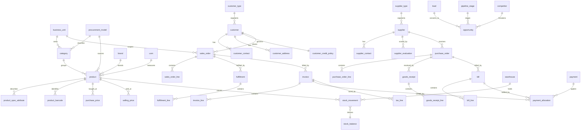

# ApexOS — Information Architecture

> **Status:** Draft for build · **Owner:** UX / IA · **Version:** 1.0 · **Date:** 2026-07-19
> **Conforms to:** `00-canonical-foundation.md` (source of truth). Entity, module, and naming
> references below use the **exact** canonical names. No new entity names are invented here.

---

## 1. IA Principles

ApexOS is a **command center**, not a form stack. Three rules govern every screen (from
Foundation §8):

> **Every page answers: What happened? · What needs attention? · What should I do?**

| Question | Where it lives on a screen | Backed by |
|---|---|---|
| **What happened?** | Activity feed / recent changes / status timeline | `activity_log` (D10) |
| **What needs attention?** | Alert strip, saved-view chips, overdue/at-risk counts | derived queries + `task`, `notification` |
| **What should I do?** | Primary action button, row actions, quick-create, assigned tasks | code workflows + `task` |

Supporting principles:

- **Single-tenant, BU-scoped.** A global **Business Unit switcher** filters every operational
  screen (D1). "All Units" is the default aggregate view.
- **Data-drive the nouns.** Every `*_type` / master entity is a Settings-managed list, never a
  hardcoded dropdown (D2). New market verticals appear as `customer_type` rows — never code.
- **Ledgers are read-mostly.** Financial and stock screens *append* movements; balances are
  derived and never edited in place (D3).
- **Spine-first.** The `Customer → Product → Sales Order → Fulfillment → Invoice → Receivable →
  Dashboard tile` slice (D4) is the reference pattern; every other module mirrors its shape.

---

## 2. Content Model / Entity Map

All entities are drawn verbatim from Foundation §5. The map below groups them by domain and
shows the primary relationships that drive navigation and screens.



### 2.1 Domain → entity index (canonical §5, unchanged)

| Domain | Entities | Surfaced in module |
|---|---|---|
| **Org & Config** | `business_unit`, `brand`, `category`, `procurement_model`, `uom`, `uom_conversion`, `customer_type`, `supplier_type`, `warehouse`, `tax_rate`, `setting` | **Settings** (all data-driven types) |
| **Identity & Access** | `user`, `role`, `permission`, `role_permission`, `user_role` | **Settings → Team & Access** |
| **Product** | `product`, `product_spec_attribute`, `product_barcode` | **Products** |
| **Partners — Customer** | `customer`, `customer_contact`, `customer_address`, `customer_credit_policy` | **Customers** |
| **Partners — Supplier** | `supplier`, `supplier_contact`, `supplier_evaluation` | **Procurement → Suppliers** |
| **Pricing** | `purchase_price`, `selling_price` | Products (selling), Procurement (purchase) |
| **Sales** | `sales_order`, `sales_order_line`, `fulfillment`, `fulfillment_line` | **Sales**, **Inventory** (fulfillment moves) |
| **Procurement** | `purchase_order`, `purchase_order_line`, `goods_receipt`, `goods_receipt_line` | **Procurement** |
| **Inventory** | `stock_movement`, `stock_balance` | **Inventory / Warehouse** |
| **Finance** | `invoice`, `invoice_line`, `bill`, `bill_line`, `payment`, `payment_allocation`, `receivable`, `payable`, `tax_line` | **Finance** |
| **CRM / Pipeline** | `lead`, `opportunity`, `pipeline_stage`, `competitor` | **Sales** (pipeline), **Customers** (leads, competitors) |
| **Platform** | `activity_log`, `task`, `document`, `notification`, `decision_log`, `sop` | **Tasks**, **Documents**, **Settings** |

---

## 3. Module → Screen Inventory

Modules follow Foundation §7 order exactly. Each operational module exposes the same four
screen archetypes so the app feels uniform:

- **List** — filterable TanStack table, saved views, bulk actions.
- **Detail** — record header + tabs; answers the three questions for one record.
- **Create / Edit** — RHF + Zod form (Sheet for quick, full page for complex).
- **Settings** — the data-driven `*_type`/master lists that feed the module.

### 3.1 Dashboard
*(absorbs 00 Dashboard, 18 Finance Dashboard, 19 KPI Dashboard)*

| Screen | Purpose | Key data |
|---|---|---|
| Command dashboard | The three questions at company scale | tiles over spine + ledgers |
| Finance dashboard | Cash position, AR/AP aging, margin | `invoice`, `bill`, `payment`, `receivable`, `payable` |
| KPI dashboard | GP %, fill rate, pipeline value | derived KPIs |

No list/create — dashboards are composed of **StatTiles** and feed panels (see §5).

### 3.2 Sales
*(16 Sales Pipeline, 09 Selling Price, 10 Margin)*

| Archetype | Screen |
|---|---|
| List | Sales Orders table; Pipeline board (`opportunity` by `pipeline_stage`) |
| Detail | Sales Order (lines, fulfillment status, invoice, margin); Opportunity |
| Create/Edit | New Sales Order (customer → lines → confirm); New Opportunity |
| Settings | Selling price lists (`selling_price`), pipeline stages (`pipeline_stage`) |

### 3.3 Customers
*(11 Customer Segments, 12 Target Customers, 17 Credit Policy, 13 Competitor Tracker)*

| Archetype | Screen |
|---|---|
| List | Customers; Leads (`lead`); Competitors (`competitor`) |
| Detail | Customer (contacts, addresses, credit policy, orders, receivables); Lead |
| Create/Edit | New Customer; New Lead; Edit Credit Policy (`customer_credit_policy`) |
| Settings | Customer types/segments (`customer_type`) |

### 3.4 Products
*(01 Product Portfolio, 02 Category Master, 03 SKU Master)*

| Archetype | Screen |
|---|---|
| List | Products (SKU master); grouped-by-Category portfolio view |
| Detail | Product (specs, barcodes, selling & purchase price history, stock across warehouses) |
| Create/Edit | New Product (SKU `BRAND-CAT-SEQ`); Edit specs (`product_spec_attribute`), barcodes |
| Settings | Category (`category`), Brand (`brand`), UOM (`uom`), Procurement Model (`procurement_model`) |

### 3.5 Inventory / Warehouse
*(14 Warehouse Master, 15 Inventory Master)*

| Archetype | Screen |
|---|---|
| List | Stock balances (`stock_balance` per product per warehouse); Movements ledger (`stock_movement`) |
| Detail | Product-in-warehouse (movement history, on-hand, incoming/outgoing) |
| Create/Edit | Record adjustment (append `stock_movement`); Goods receipt & fulfillment post here |
| Settings | Warehouses (`warehouse`) |

> Balances are **derived, read-only** (D3). The only write is an append movement or an
> explicit adjustment reason.

### 3.6 Procurement / Purchase Orders / Suppliers
*(04 Manufacturer DB, 05 Distributor DB, 06 Vendor Evaluation, 07 Procurement Strategy, 08 Purchase Price)*

| Archetype | Screen |
|---|---|
| List | Purchase Orders; Suppliers; Vendor Evaluations (`supplier_evaluation`) |
| Detail | Purchase Order (lines, goods receipt, bill); Supplier (contacts, evaluations, purchase prices) |
| Create/Edit | New Purchase Order; New Supplier; New Evaluation; Set purchase price (`purchase_price`) |
| Settings | Supplier types (`supplier_type`), Procurement models (`procurement_model`) |

### 3.7 Finance
*(17 Credit Policy, 18 Finance Dashboard)*

| Archetype | Screen |
|---|---|
| List | Invoices; Bills; Payments; Receivables aging; Payables aging |
| Detail | Invoice (lines, tax, allocations); Bill; Payment (allocations) |
| Create/Edit | Record Payment (`payment` + `payment_allocation`); Issue Invoice / Bill |
| Settings | Tax rates / GST slabs (`tax_rate`), QuickBooks connector config |

### 3.8 Reports / Analytics
*(19 KPI Dashboard)*

| Archetype | Screen |
|---|---|
| List | Report catalog (Margin, GP by category, Fill rate, AR aging, Supplier scorecard) |
| Detail | Report canvas with filters, export |
| Create/Edit | Saved report / saved view definitions |
| Settings | — (uses global BU + date scope) |

### 3.9 Tasks / Documents / Settings
*(20 Decisions Log, 21 Roadmap, 22 SOP Index)*

| Screen | Backed by |
|---|---|
| Tasks (list/detail/create) | `task` |
| Documents (list/detail/upload) | `document` (R2) |
| Decisions Log | `decision_log` (ADRs) |
| SOP Index | `sop` |
| Settings hub | all Org & Config + Identity & Access entities (see §6) |

---

## 4. URL / Route Map

REST-aligned with Foundation §6 (`kebab-case`, plural resources). App routes mirror the API
resource names for predictability. `[id]` is the UUID v7 surrogate; human codes (SO-…, SKU)
are display-only.

| Module | List | Detail | Create | Edit |
|---|---|---|---|---|
| Dashboard | `/` | — | — | — |
| Dashboard (finance) | `/dashboard/finance` | — | — | — |
| Dashboard (KPI) | `/dashboard/kpi` | — | — | — |
| Sales orders | `/sales-orders` | `/sales-orders/[id]` | `/sales-orders/new` | `/sales-orders/[id]/edit` |
| Pipeline | `/pipeline` | `/opportunities/[id]` | `/opportunities/new` | `/opportunities/[id]/edit` |
| Customers | `/customers` | `/customers/[id]` | `/customers/new` | `/customers/[id]/edit` |
| Leads | `/leads` | `/leads/[id]` | `/leads/new` | `/leads/[id]/edit` |
| Competitors | `/competitors` | `/competitors/[id]` | `/competitors/new` | `/competitors/[id]/edit` |
| Products | `/products` | `/products/[id]` | `/products/new` | `/products/[id]/edit` |
| Inventory (balances) | `/inventory` | `/inventory/[productId]` | — | — |
| Stock movements | `/inventory/movements` | `/inventory/movements/[id]` | `/inventory/movements/new` (adjustment) | — |
| Purchase orders | `/purchase-orders` | `/purchase-orders/[id]` | `/purchase-orders/new` | `/purchase-orders/[id]/edit` |
| Goods receipts | `/goods-receipts` | `/goods-receipts/[id]` | `/goods-receipts/new` | — |
| Suppliers | `/suppliers` | `/suppliers/[id]` | `/suppliers/new` | `/suppliers/[id]/edit` |
| Vendor evaluations | `/suppliers/[id]/evaluations` | `/vendor-evaluations/[id]` | `/vendor-evaluations/new` | `/vendor-evaluations/[id]/edit` |
| Invoices | `/invoices` | `/invoices/[id]` | `/invoices/new` | — (ledger, void not edit) |
| Bills | `/bills` | `/bills/[id]` | `/bills/new` | — |
| Payments | `/payments` | `/payments/[id]` | `/payments/new` | — |
| Receivables | `/receivables` | `/receivables/[customerId]` | — | — |
| Payables | `/payables` | `/payables/[supplierId]` | — | — |
| Reports | `/reports` | `/reports/[slug]` | `/reports/new` | `/reports/[slug]/edit` |
| Tasks | `/tasks` | `/tasks/[id]` | `/tasks/new` | `/tasks/[id]/edit` |
| Documents | `/documents` | `/documents/[id]` | `/documents/upload` | — |
| Decisions log | `/settings/decisions` | `/settings/decisions/[id]` | `/settings/decisions/new` | — |
| SOP index | `/settings/sops` | `/settings/sops/[id]` | `/settings/sops/new` | `/settings/sops/[id]/edit` |
| Settings | `/settings` | `/settings/[section]` | — | — |

**API mirror** (Foundation §6): each list route maps to `/api/v1/<resource>`, e.g.
`/sales-orders` → `GET /api/v1/sales-orders`, `/sales-orders/[id]` → `GET /api/v1/sales-orders/{id}`.

**Route conventions**

- Global BU scope lives in query/state, not the path: `?bu=<id>` (or "all"). Keeps deep links
  shareable across units.
- List filters serialize to query params (`?status=overdue&segment=hotel&view=at-risk`) so
  every saved view is a URL.
- Ledger records (`/invoices`, `/bills`, `/payments`, movements) have **no `/edit`** — they are
  append-only (D3); corrections are new movements, credit notes, or voids.

---

## 5. The Three-Question Pattern, Applied

Concrete layout of the pattern on the two most-visited screens.

### 5.1 Command Dashboard (`/`)

```
┌───────────────────────────────────────────────────────────────────────┐
│  Dashboard            Business Unit: [ All Units ▾ ]      This month ▾  │
├───────────────────────────────────────────────────────────────────────┤
│  WHAT NEEDS ATTENTION                                                   │
│  ┌──────────┐ ┌──────────┐ ┌──────────┐ ┌──────────┐                   │
│  │ Overdue  │ │ Low stock│ │ SOs to   │ │ Credit   │  ← StatTiles      │
│  │ AR ₹4.2L │ │ 7 SKUs   │ │ fulfill 5│ │ holds 2  │    (red/amber)    │
│  └──────────┘ └──────────┘ └──────────┘ └──────────┘                   │
├─────────────────────────────────────┬─────────────────────────────────┤
│  WHAT HAPPENED (activity_log feed)  │  WHAT TO DO (my tasks)          │
│  • INV-202607-00142 paid  · 2m      │  ☐ Approve PO-202607-0031       │
│  • SO-202607-00512 fulfilled · 1h   │  ☐ Call lead: Grand Sarovar     │
│  • Buy price updated AUR-TIS-001    │  ☐ Review vendor eval: PaperW.  │
│  • New customer: Blue Café · 3h     │  [ + Quick create  (c) ]        │
├─────────────────────────────────────┴─────────────────────────────────┤
│  KPI ROW: GP % 31.4 ▲ · Fill rate 96% · Pipeline ₹18L · Cash ₹12.6L    │
└───────────────────────────────────────────────────────────────────────┘
```

### 5.2 Any Detail Screen (e.g. `/sales-orders/[id]`)

```
┌───────────────────────────────────────────────────────────────────────┐
│  ← Sales Orders / SO-202607-00512        [Status: Fulfilling ●]  ⋯     │  ← PageHeader
│  Blue Café · BU: HoReCa South · ₹42,180 · Margin 29%   [Fulfill] [Invoice]│  Primary actions = "what to do"
├───────────────────────────────────────────────────────────────────────┤
│  [ Lines ] [ Fulfillment ] [ Invoice ] [ Activity ] [ Documents ]      │  ← tabs
├───────────────────────────────────────────────────────────────────────┤
│  ATTENTION: 1 line short-shipped · Credit limit 82% used               │  ← inline alert strip
│  ┌─ Lines table ─────────────────────────────────────────────────┐    │
│  │ SKU         Product            Qty  UOM  Price   GP%   Status   │    │
│  │ AUR-TIS-001 Aura Toilet Roll   200  Pack ₹38     31%   ✓ Ful.   │    │
│  └───────────────────────────────────────────────────────────────┘    │
│  ── Activity (what happened) ──────────────────────────────────────    │
│  • Fulfillment #2 posted 190/200 · Tushar · 1h ago                     │
└───────────────────────────────────────────────────────────────────────┘
```

Every detail screen carries: **PageHeader** (identity + status + primary action = *what to
do*), an optional **attention strip** (*what needs attention*), and an **Activity** tab sourced
from `activity_log` (*what happened*).

---

## 6. Global Search & Command Palette (⌘K)

A single **⌘K** palette is the primary navigation and action surface (keyboard-first north
star). It has three modes, auto-detected by input:

```
┌── ⌘K ──────────────────────────────────────────────┐
│  ⌕ Type to search, or run a command…               │
├────────────────────────────────────────────────────┤
│  JUMP TO                                            │
│    → Sales Orders            g s                    │
│    → Customers               g c                    │
│  RECORDS  (search)                                  │
│    ▸ Blue Café               Customer               │
│    ▸ SO-202607-00512         Sales Order  ₹42,180   │
│    ▸ AUR-TIS-001 Aura Roll   Product                │
│  ACTIONS                                            │
│    + New Sales Order         c then s               │
│    + Record Payment                                 │
│    ⚙ Open Settings → Categories                     │
└────────────────────────────────────────────────────┘
```

| Mode | Trigger | Backed by |
|---|---|---|
| **Navigate** | any text matching a module | route map (§4) |
| **Find record** | text matching codes/names | federated search across `customer`, `product`, `sales_order`, `purchase_order`, `invoice`, `supplier`, `lead` (indexed human codes + names) |
| **Run action** | verbs / `+` prefix | create routes + service actions (record payment, fulfill, etc.) |

**Search index scope** = human-facing codes (SO/PO/INV/SKU) + names + key attributes, always
filtered by the active BU and the user's `permission` set. Results carry an entity **Badge** so
type is unambiguous. Recent + frequent items show on empty query.

---

## 7. How Data-Driven Types Surface in Settings

Per D2, every noun-list is a Settings-managed table — never a hardcoded enum. Settings is the
single home for all `*_type` and master entities.

```
/settings
├── Organization
│   ├── Business Units        → business_unit
│   ├── Brands                → brand
│   ├── Categories            → category (→business_unit, →procurement_model)
│   ├── Procurement Models    → procurement_model
│   ├── Units of Measure      → uom, uom_conversion
│   └── Warehouses            → warehouse
├── Partners
│   ├── Customer Types        → customer_type
│   └── Supplier Types        → supplier_type
├── Finance
│   ├── Tax Rates (GST)       → tax_rate
│   └── QuickBooks Connector  → setting (Finance bridge)
├── Team & Access
│   ├── Users                 → user, user_role
│   ├── Roles                 → role, role_permission
│   └── Permissions           → permission
├── Sales
│   └── Pipeline Stages       → pipeline_stage
├── Governance
│   ├── Decisions Log (ADRs)  → decision_log
│   └── SOP Index             → sop
└── Preferences               → setting (key/value)
```

**Type-list screen pattern** (same for every master): a compact table (name, code, usage
count, active toggle, reorder handle) + inline create + soft-delete (D7). Because Categories
roll up to Business Units and reference a Procurement Model, its editor shows those as
selects sourced from their own master tables — proving the "nouns are data" rule end to end.

Adding a new market vertical (Hospital, Factory, …) is therefore a **Settings action** —
inserting a `customer_type` row — with **zero code change** (Foundation §1, "nothing hardcoded
to restaurants").

---

## 8. IA Acceptance Checklist

- [ ] Every module exposes List / Detail / Create-Edit / Settings where applicable (§3).
- [ ] Every entity in Foundation §5 has exactly one home module (§2.1) — no orphans, no dupes.
- [ ] All routes are `kebab-case`, plural, and mirror `/api/v1/*` (§4, Foundation §6).
- [ ] Ledger resources expose no `/edit` route (D3).
- [ ] Every screen renders the three questions (§1, §5).
- [ ] Every dropdown of a `*_type` is sourced from a Settings master, not code (§7, D2).
- [ ] ⌘K resolves navigate / find / act, BU- and permission-scoped (§6).
