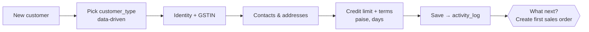
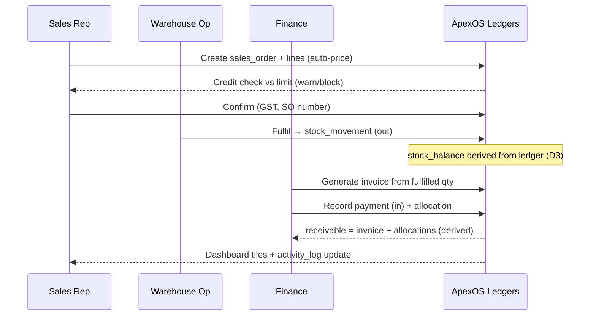
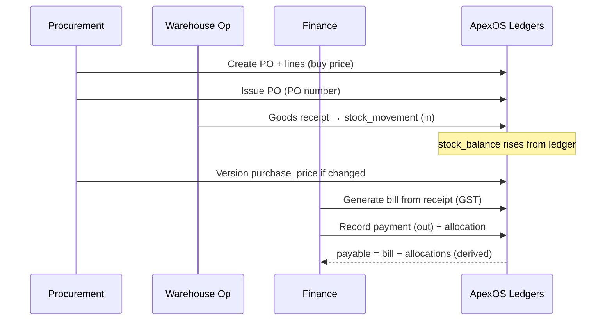
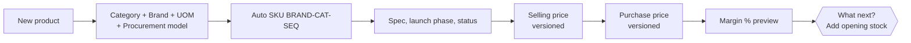
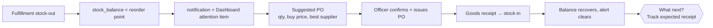
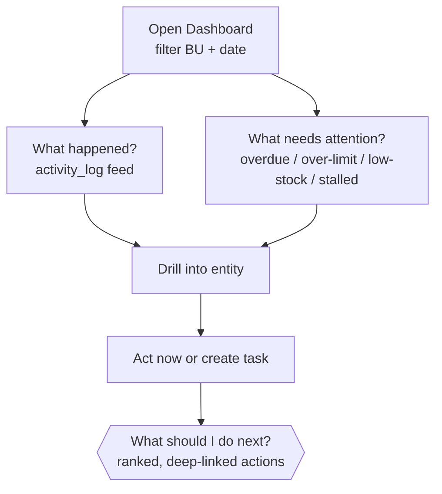

# ApexOS — User Journeys

> **Status:** Draft for build · **Owner:** Product · **Version:** 1.0 · **Date:** 2026-07-19
>
> Conforms to `00-canonical-foundation.md`. Six core end-to-end journeys. Each has a step table and a
> Mermaid diagram, and each calls out **time saved** and the **"what should I do next?"** moment —
> the design north star (every page answers *What happened? · What needs attention? · What should I do?*).

---

## Journey A — Onboard a Customer with Credit Policy

**Actor:** Sales Rep · **Modules:** Customers, Settings · **Entities:** `customer`, `customer_type`,
`customer_contact`, `customer_address`, `customer_credit_policy`

| # | Step | System behaviour | Entity write |
|---|---|---|---|
| 1 | New customer | Rep opens Customers → New | — |
| 2 | Pick customer type | Dropdown from `customer_type` (Restaurant, Hotel, Café, Hospital…). **Data-driven, not hardcoded.** | — |
| 3 | Enter identity | Name, GSTIN, billing state (for GST place-of-supply) | `customer` (draft) |
| 4 | Add contacts & addresses | One or more each | `customer_contact`, `customer_address` |
| 5 | Set credit policy | Credit limit (paise, **D5**), payment terms (days), status | `customer_credit_policy` |
| 6 | Save | Validates GSTIN format; logs event | `customer` (active), `activity_log` (**D10**) |
| 7 | **What next?** | Card: *"Customer ready — create first sales order"* → deep-links to Sales · New | — |

- **Time saved:** one guided form vs. touching Customer Segments (11) + Credit Policy (17) sheets by hand.
- **What should I do next?** Step 7 hands the rep straight into the first order.

---

## Journey B — Sales Order → Fulfillment → Invoice → Payment (the Spine, D4)

**Actors:** Sales Rep, Warehouse Op, Finance · **Modules:** Sales, Warehouse, Finance ·
**Entities:** `sales_order(+line)`, `fulfillment(+line)`, `stock_movement`, `invoice(+line)`,
`tax_line`, `payment`, `payment_allocation`, derived `receivable`

| # | Step | Actor | System behaviour | Entity write |
|---|---|---|---|---|
| 1 | Create order | Sales | Pick customer; add lines (SKU, qty, UOM) | `sales_order` draft |
| 2 | Price lines | Sales | Auto-price from active `selling_price` (customer/segment); override needs reason | `sales_order_line` |
| 3 | Credit check | Sales | Compare (outstanding `receivable` + order) vs. credit limit; warn/block if breached | — |
| 4 | Confirm | Sales | GST computed via `tax_rate`; totals in paise; number `SO-YYYYMM-#####` | `sales_order` confirmed, `tax_line` |
| 5 | Fulfil | Warehouse | Pick against `stock_balance`; write stock-out movements (signed `qty_delta`, `ref_type=fulfillment`) | `fulfillment(+line)`, `stock_movement` |
| 6 | Invoice | Finance | Generate `invoice` from fulfilled qty; `INV-YYYYMM-#####`; GST mirrored | `invoice(+line)`, `tax_line` |
| 7 | Payment | Finance | Record `payment` (in); allocate to invoice | `payment`, `payment_allocation` |
| 8 | Balance | System | `receivable` **derived** = invoice − allocations (never overwritten, **D3**) | — |
| 9 | Dashboard | Founder | Revenue, GP, receivables tiles update; event in feed | `activity_log` |
| 10 | **What next?** | — | If partially paid → *"Chase balance on INV-…"*; if fulfilled-not-invoiced → *"Invoice SO-…"* | — |

- **Time saved:** order → invoice with GST auto-flows; no re-keying across Selling Price (09), Inventory
  (15), Finance (18) sheets; no manual receivable math.
- **What should I do next?** Step 10 surfaces the exact next action per order state.

---

## Journey C — Purchase Order → Goods Receipt → Bill → Payment

**Actors:** Procurement Officer, Warehouse Op, Finance · **Modules:** Purchase Orders, Suppliers,
Warehouse, Finance · **Entities:** `purchase_order(+line)`, `goods_receipt(+line)`, `stock_movement`,
`purchase_price`, `bill(+line)`, `payment`, `payment_allocation`, derived `payable`

| # | Step | Actor | System behaviour | Entity write |
|---|---|---|---|---|
| 1 | Create PO | Procurement | Pick supplier (`supplier_type` Manufacturer/Distributor); add SKUs, qty | `purchase_order` draft |
| 2 | Price lines | Procurement | Default to active `purchase_price` for that supplier | `purchase_order_line` |
| 3 | Issue PO | Procurement | Number `PO-YYYYMM-#####`; status issued | `purchase_order` issued, `activity_log` |
| 4 | Receive goods | Warehouse | Goods receipt vs PO; partial allowed; stock-in movements (`ref_type=goods_receipt`) | `goods_receipt(+line)`, `stock_movement` |
| 5 | Price update | Procurement | If invoice price differs, version a new `purchase_price` (history kept) | `purchase_price` |
| 6 | Bill | Finance | Generate `bill` from receipt; GST captured | `bill(+line)`, `tax_line` |
| 7 | Pay | Finance | Record `payment` (out); allocate to bill | `payment`, `payment_allocation` |
| 8 | Balance | System | `payable` **derived** = bill − allocations (**D3**) | — |
| 9 | **What next?** | — | Received-not-billed → *"Bill GRN-…"*; due soon → *"Schedule payment to <supplier>"* | — |

- **Time saved:** Manufacturer/Distributor DB (04/05), Purchase Price (08) and Inventory (15) stay in
  sync automatically; buy-price history is preserved for margin.
- **What should I do next?** Step 9 drives the receive→bill→pay chain without a spreadsheet chase.

---

## Journey D — Add a SKU with Pricing

**Actor:** Procurement Officer / Admin · **Modules:** Products, Categories, Pricing ·
**Entities:** `product`, `category`, `brand`, `uom`, `procurement_model`, `selling_price`, `purchase_price`

| # | Step | System behaviour | Entity write |
|---|---|---|---|
| 1 | New product | Products → New | — |
| 2 | Classify | Pick category (1 of 9), brand (Aura/Apex), UOM (Pack/Roll), procurement model | — |
| 3 | SKU code | Auto-suggest `BRAND-CAT-SEQ` e.g. `AUR-TIS-001`; unique & indexed (**D6**) | — |
| 4 | Specify | Specification (e.g. "2 Ply", "19x21", "M Fold"), launch phase, status | `product` |
| 5 | Sell price | Set `selling_price` (versioned, `valid_from`); per customer/segment optional | `selling_price` |
| 6 | Buy price | Set `purchase_price` per supplier (versioned) | `purchase_price` |
| 7 | Margin preview | Show GP = sell − buy and margin % before save | — |
| 8 | Save | Log event | `product`, `activity_log` |
| 9 | **What next?** | *"SKU live — add opening stock"* → Warehouse; or *"add to a sales order"* | — |

- **Time saved:** one screen replaces Product Portfolio (01) + SKU Master (03) + Selling (09) + Purchase (08)
  sheets; margin visible before commit.
- **What should I do next?** Step 9 links to opening stock or first order.

---

## Journey E — Low-Stock Alert → Replenishment

**Actors:** Warehouse Op, Procurement Officer · **Modules:** Inventory, Procurement, Purchase Orders ·
**Entities:** `stock_balance` (derived), `stock_movement`, `product`, `supplier`, `purchase_order`

| # | Step | System behaviour | Entity write |
|---|---|---|---|
| 1 | Trigger | A stock-out movement drops `stock_balance` below the SKU's reorder point | — |
| 2 | Detect | System flags low-stock; raises `notification` and a Dashboard "needs attention" item | `notification` |
| 3 | Review | Procurement sees low-stock list with on-hand, reorder point, preferred supplier | — |
| 4 | Suggest PO | System proposes a `purchase_order` (SKU, suggested qty, active `purchase_price`, best-scored supplier) | draft `purchase_order` |
| 5 | Confirm | Officer adjusts qty/supplier; issues PO (`PO-YYYYMM-#####`) | `purchase_order` issued |
| 6 | Close loop | Goods receipt (Journey C) writes stock-in; `stock_balance` recovers; alert clears | `goods_receipt`, `stock_movement` |
| 7 | **What next?** | *"PO issued — expect receipt by <date>"*; other low SKUs still listed | — |

- **Time saved:** no manual scan of Inventory (15) vs. Warehouse (14); replenishment is proposed, not
  hunted for.
- **What should I do next?** Steps 2 & 4 turn a passive number into a one-click PO.

---

## Journey F — Founder's Morning Dashboard Review

**Actor:** Founder / COO · **Modules:** Dashboard (00, 18, 19) ·
**Entities:** `activity_log`, derived `receivable`/`payable`, `stock_balance`, `invoice`, `payment`

| # | Step | System behaviour |
|---|---|---|
| 1 | Open Dashboard | KPI tiles: revenue, GP/margin %, receivables, cash, low-stock, open orders — filterable by Business Unit + date |
| 2 | What happened? | Overnight `activity_log` feed: new orders, fulfilments, invoices, payments |
| 3 | What needs attention? | Overdue receivables, over-limit customers, low-stock SKUs, stalled leads — each a live count |
| 4 | Drill | Click a tile → filtered list → a specific entity |
| 5 | Act / delegate | Create a `task` or jump straight into the action (chase receivable, approve PO) |
| 6 | **What should I do next?** | Ranked action list, highest-impact first, each deep-linked |

- **Time saved:** replaces manually reading Dashboard (00), Finance (18) and KPI (19) sheets; the whole
  company's state in one glance.
- **What should I do next?** Step 6 is the command-center payoff — the founder leaves the screen with a
  prioritised list, not a spreadsheet to interpret.

---

## Cross-Journey Notes

- **Every** mutation writes to `activity_log` (**D10**) → powers "What happened?" everywhere.
- **Every** stock and money change is an append-only movement/allocation (**D3**); balances are derived.
- **Every** "What next?" card is a deep link — the design contract that no screen is a dead end.
