# ApexOS — Database ER Diagram & Physical Schema

> **Status:** Draft for build · **Owner:** Architecture / Database · **Version:** 1.0 · **Date:** 2026-07-19
>
> Conforms to `00-canonical-foundation.md`. Table/column names are canonical (§5) and follow
> `11-naming-standards.md`. Honors **D1** (single-tenant + `business_unit_id`), **D2** (data-driven
> types), **D3** (append-only ledgers), **D5** (money as integer `_minor` paise), **D6** (UUID v7 PKs),
> **D7** (soft-delete + audit columns), **D9** (`timestamptz` UTC, GST-aware), **D10** (`activity_log`).
> **Where this document and the foundation disagree, the foundation wins.**

---

## 0. Conventions (stated once — do not repeat per table)

### 0.1 Standard columns on every base table

Unless a per-table **exception** is noted, every table below carries this **audit set (D7)**:

| Column | Type | Constraints | Notes |
|---|---|---|---|
| `id` | `uuid` | PK, `DEFAULT uuid_generate_v7()` | UUID v7 surrogate key (D6); time-sortable, no business meaning. |
| `created_at` | `timestamptz` | `NOT NULL DEFAULT now()` | UTC (D9). |
| `created_by` | `uuid` | `NULL`, FK → `user(id)` `ON DELETE RESTRICT` | Actor. NULL only for system/seed rows. |
| `updated_at` | `timestamptz` | `NOT NULL DEFAULT now()` | Bumped on every UPDATE (app/trigger). |
| `updated_by` | `uuid` | `NULL`, FK → `user(id)` `ON DELETE RESTRICT` | Actor of last mutation. |
| `deleted_at` | `timestamptz` | `NULL` | Soft-delete tombstone (D7). `NULL` = live row. |

**Operational tables also carry `business_unit_id`** (D1):

| Column | Type | Constraints | Notes |
|---|---|---|---|
| `business_unit_id` | `uuid` | `NOT NULL`, FK → `business_unit(id)` `ON DELETE RESTRICT` | The first-class BU dimension. |

**Which tables get `business_unit_id`:** all operational/transactional tables (product, customer,
supplier, orders, fulfilment, receipts, ledgers, pricing, CRM, tasks, documents, notifications).
**Which do NOT:** global config/type masters (`business_unit`, `brand`, `procurement_model`, `uom`,
`uom_conversion`, `customer_type`, `supplier_type`, `tax_rate`, `role`, `permission`, and the two IAM
junctions). `category`, `warehouse`, `setting`, `pipeline_stage`, `sop` carry a **nullable** BU column
where noted (BU-scoped-or-global). `user` carries a nullable `business_unit_id` (home BU).

### 0.2 Ledger exception (D3)

**Append-only ledger tables** — `stock_movement`, `invoice`, `invoice_line`, `bill`, `bill_line`,
`payment`, `payment_allocation`, `tax_line`, `activity_log` — are **immutable financial/stock facts**.
Exception to the standard set: they keep `created_at` / `created_by` **only** (no `updated_at`,
`updated_by`, `deleted_at`). Corrections are made by **posting a reversing entry**, never by UPDATE or
DELETE. Documents (`invoice`/`bill`) additionally carry a `status` that transitions via new events;
their monetary columns are write-once.

### 0.3 Type conventions

- **Money:** `*_minor` as `bigint` (integer paise, D5) + `currency char(3) NOT NULL DEFAULT 'INR'`. Never `float`/`numeric` for money.
- **Quantities:** `numeric(18,4)` (fractional packs/rolls possible); signed deltas use `qty_delta`.
- **Tax rates:** `rate_bps int` (basis points; `1800` = 18.00%) — exact, no float.
- **Enum-likes:** rows in `*_type`/master tables (D2). **Truly-fixed** enums stay inline as
  `varchar` + `CHECK` (documented per table), e.g. `payment.direction`.
- **GSTIN** `char(15)`, **PAN** `char(10)`, **state_code** `char(2)` (GST state code), **pincode** `char(6)`.
- **Codes** (`code`, `sku_code`, `*_no`) are `varchar`, `UNIQUE` (partial, scoped `WHERE deleted_at IS NULL`), indexed.
- **Polymorphic links** (`ref_type`/`ref_id`, `entity_type`/`entity_id`, `party_type`/`party_id`,
  `target_type`/`target_id`, `source_type`/`source_id`) have **no DB-level FK** — integrity enforced in
  the service layer. Always indexed as a composite `(x_type, x_id)`.

### 0.4 ADDED tables (not literally in §5) and their justification

| Added table | Justification |
|---|---|
| `number_sequence` | Atomic per-BU, per-month document counters for `SO-/PO-/INV-/BILL-/GRN-YYYYMM-#####` (§7 naming). A row-locked counter is the only safe way to allocate gapless-enough numbers under concurrency. |
| `opportunity_competitor` | Resolves the **M:N** between `opportunity` and `competitor` (a deal can involve several competitors; a competitor appears in many deals). |
| `stock_balance` | §5 explicitly names it as a **materialized/derived** projection over `stock_movement` — modelled here as a `MATERIALIZED VIEW`, not a base table. |
| `receivable` / `payable` | §5 names them as **derived** — modelled as `VIEW`s over `invoice`/`bill` minus `payment_allocation`. |

Everything else below is an exact §5 name (plus the two §5 junctions `role_permission`, `user_role`).

---

## 1. ER Diagrams (by domain)

### 1.1 Org / Config (data-driven types — D2)

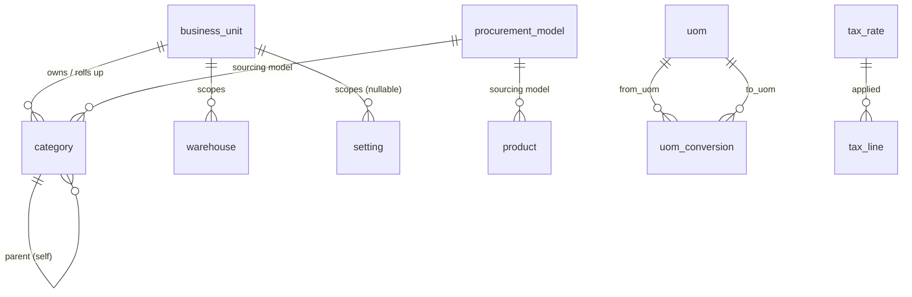

### 1.2 Identity & Access

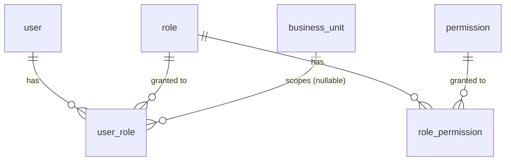

### 1.3 Product

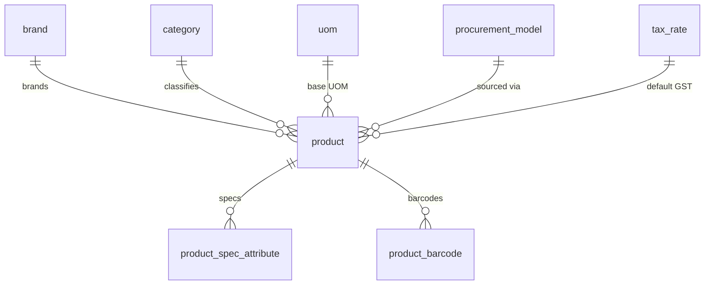

### 1.4 Partners (Customers & Suppliers)

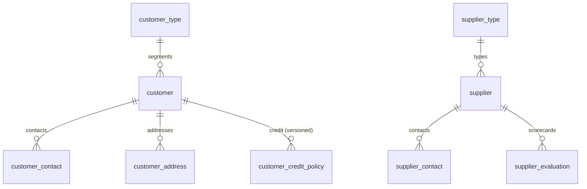

### 1.5 Pricing (versioned — D3 spirit)

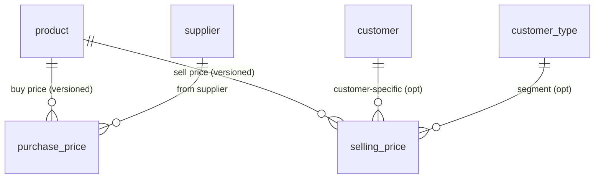

### 1.6 Sales

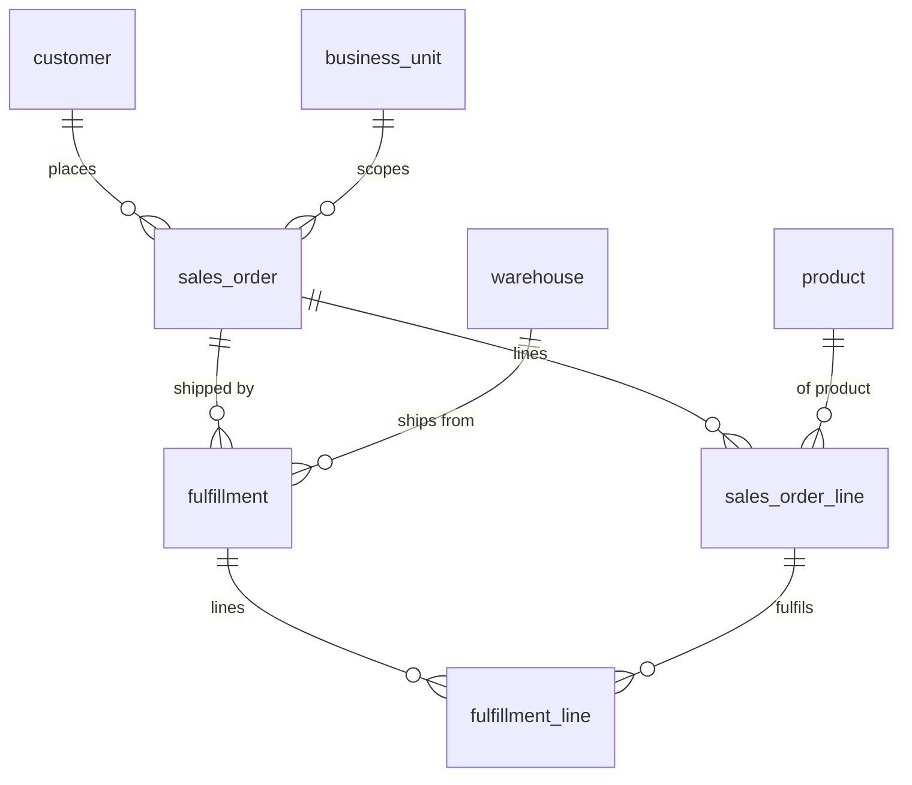

### 1.7 Procurement

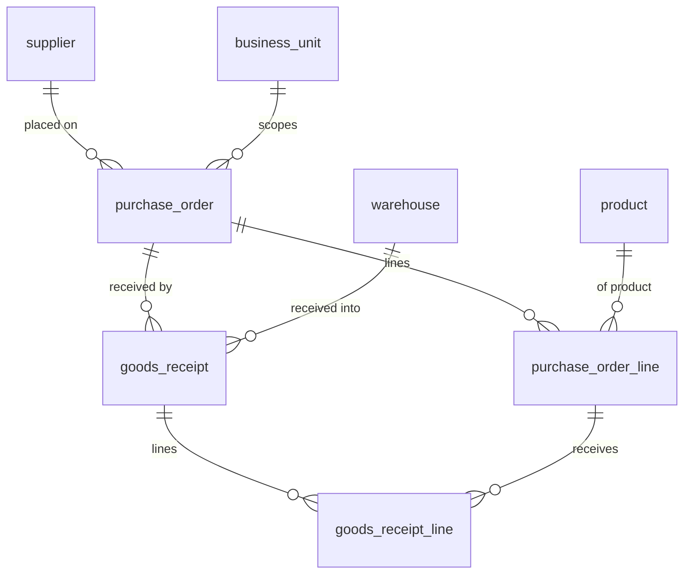

### 1.8 Inventory (append-only ledger + derived balance)

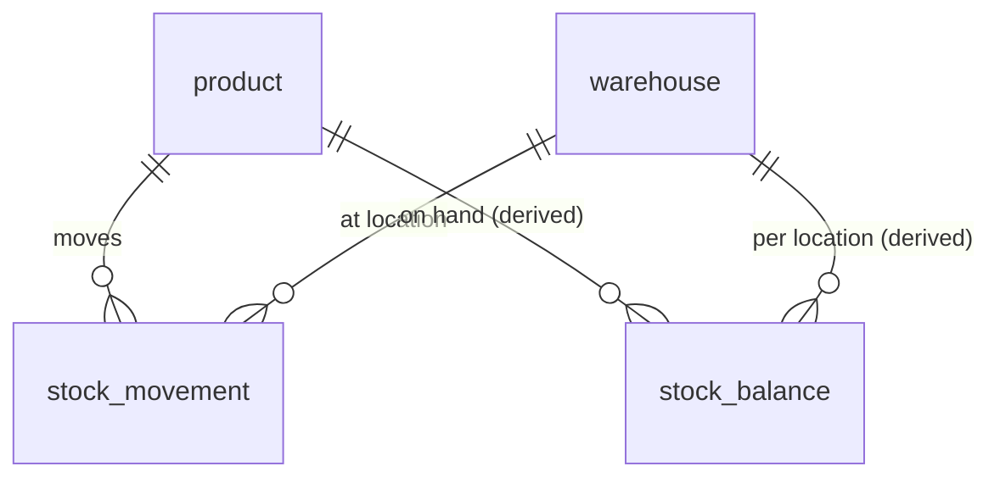

`stock_movement.(ref_type, ref_id)` polymorphically points at `fulfillment`, `goods_receipt`,
or a manual adjustment. `stock_balance` = `MATERIALIZED VIEW` of `SUM(qty_delta)`.

### 1.9 Finance (append-only ledgers + derived AR/AP)

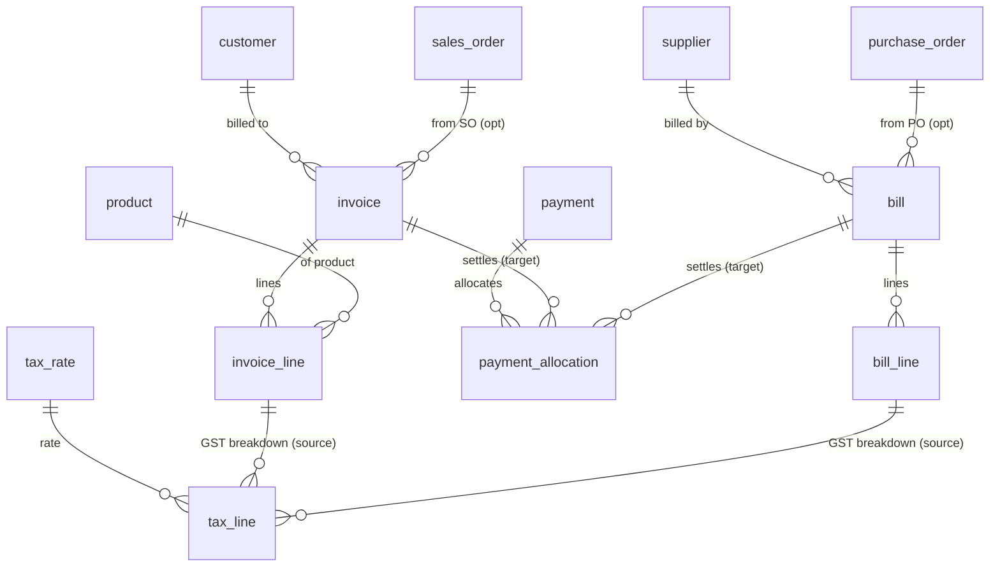

`receivable` (per customer/invoice) and `payable` (per supplier/bill) are **VIEWs**: document total
minus `SUM(payment_allocation.amount_minor)`.

### 1.10 CRM / Pipeline

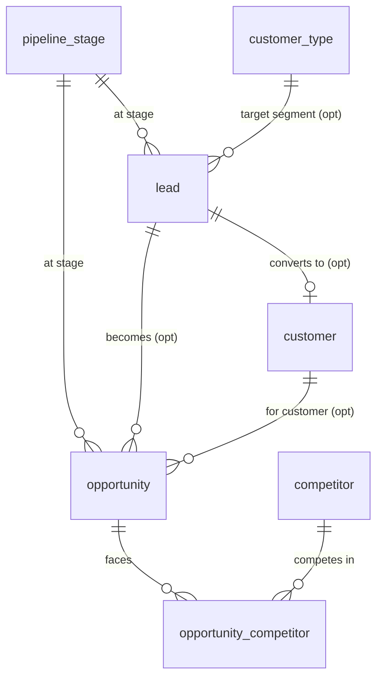

### 1.11 Platform (cross-cutting)

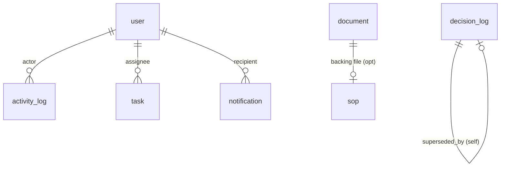

`activity_log`, `task`, `document`, `notification` link polymorphically to **any** entity via
`(entity_type, entity_id)`.

---

## 2. Column specifications

> Audit set + `business_unit_id` per §0 are **implied**. Only exceptions and business columns are listed.

### 2.1 Org / Config

#### `business_unit`  — *exception: no `business_unit_id`*
| name | type | constraints | notes |
|---|---|---|---|
| `code` | `varchar(16)` | `NOT NULL`, unique (partial) | e.g. `HORECA`. |
| `name` | `varchar(120)` | `NOT NULL` | Display name. |
| `is_active` | `boolean` | `NOT NULL DEFAULT true` | |

#### `brand` — *exception: no `business_unit_id`*
| name | type | constraints | notes |
|---|---|---|---|
| `code` | `char(3)` | `NOT NULL`, unique (partial) | SKU brand segment: `AUR`, `APX`. |
| `name` | `varchar(120)` | `NOT NULL` | Aura, Apex. |
| `is_active` | `boolean` | `NOT NULL DEFAULT true` | |

#### `procurement_model` — *exception: no `business_unit_id`*
| name | type | constraints | notes |
|---|---|---|---|
| `code` | `varchar(24)` | `NOT NULL`, unique (partial) | `PRIVATE_LABEL`, `MASTER_DIST`, `MFR_MASTER_DIST`, `CONTRACT_MFR`. |
| `name` | `varchar(120)` | `NOT NULL` | Private Label, Master Distributor, … |
| `is_active` | `boolean` | `NOT NULL DEFAULT true` | |

#### `category` — *exception: `business_unit_id` is a real roll-up FK (NOT NULL)*
| name | type | constraints | notes |
|---|---|---|---|
| `business_unit_id` | `uuid` | `NOT NULL`, FK → `business_unit` | Category rolls up to a BU (§4). |
| `procurement_model_id` | `uuid` | `NULL`, FK → `procurement_model` | Default sourcing model for the category. |
| `parent_category_id` | `uuid` | `NULL`, FK → `category` (self) | Reserved for future sub-categories; top-level = NULL. |
| `code` | `varchar(4)` | `NOT NULL`, unique (partial) | SKU category segment: `TIS`, `GB`. |
| `name` | `varchar(120)` | `NOT NULL` | Tissue & Paper Consumables, … (9 real values). |
| `sort_order` | `smallint` | `NOT NULL DEFAULT 0` | |
| `is_active` | `boolean` | `NOT NULL DEFAULT true` | |

#### `uom` — *exception: no `business_unit_id`*
| name | type | constraints | notes |
|---|---|---|---|
| `code` | `varchar(16)` | `NOT NULL`, unique (partial) | `PACK`, `ROLL`, `CASE`. |
| `name` | `varchar(60)` | `NOT NULL` | Pack, Roll. |
| `is_active` | `boolean` | `NOT NULL DEFAULT true` | |

#### `uom_conversion` — *exception: no `business_unit_id`*
| name | type | constraints | notes |
|---|---|---|---|
| `from_uom_id` | `uuid` | `NOT NULL`, FK → `uom` | e.g. Case. |
| `to_uom_id` | `uuid` | `NOT NULL`, FK → `uom` | e.g. Pack. |
| `factor` | `numeric(18,6)` | `NOT NULL`, `CHECK (factor > 0)` | `1 from_uom = factor × to_uom` (Case→Pack = 12). |
| — | | `UNIQUE (from_uom_id, to_uom_id)` WHERE `deleted_at IS NULL` | Non-cyclic, validated in service. |

#### `customer_type` — *exception: no `business_unit_id`*
| name | type | constraints | notes |
|---|---|---|---|
| `code` | `varchar(24)` | `NOT NULL`, unique (partial) | `RESTAURANT`, `HOTEL`, `CAFE`, `HOSPITAL`, … |
| `name` | `varchar(120)` | `NOT NULL` | Extensible; **never hardcoded**. |
| `is_active` | `boolean` | `NOT NULL DEFAULT true` | |

#### `supplier_type` — *exception: no `business_unit_id`*
| name | type | constraints | notes |
|---|---|---|---|
| `code` | `varchar(24)` | `NOT NULL`, unique (partial) | `MANUFACTURER`, `DISTRIBUTOR`. |
| `name` | `varchar(120)` | `NOT NULL` | Manufacturer, Distributor (incl. Master Distributor). |
| `is_active` | `boolean` | `NOT NULL DEFAULT true` | |

#### `warehouse`
| name | type | constraints | notes |
|---|---|---|---|
| `code` | `varchar(24)` | `NOT NULL`, unique (partial) | |
| `name` | `varchar(120)` | `NOT NULL` | |
| `line1`, `line2` | `varchar(200)` | `NULL` | Location. |
| `city` | `varchar(80)` | `NULL` | |
| `state_code` | `char(2)` | `NULL` | GST state code (place-of-supply logic). |
| `pincode` | `char(6)` | `NULL` | |
| `gstin` | `char(15)` | `NULL` | Warehouse registration, if distinct. |
| `is_active` | `boolean` | `NOT NULL DEFAULT true` | |

#### `tax_rate` (GST slabs) — *exception: no `business_unit_id`; versioned*
| name | type | constraints | notes |
|---|---|---|---|
| `code` | `varchar(24)` | `NOT NULL` | `GST_0`, `GST_5`, `GST_12`, `GST_18`, `GST_28`. |
| `name` | `varchar(60)` | `NOT NULL` | "GST 18%". |
| `rate_bps` | `int` | `NOT NULL`, `CHECK (rate_bps >= 0)` | Total GST in basis points (1800 = 18%). |
| `valid_from` | `date` | `NOT NULL` | Slab effective date. |
| `valid_to` | `date` | `NULL` | `NULL` = current. Never edit history (D3 spirit). |
| `is_active` | `boolean` | `NOT NULL DEFAULT true` | |
| — | | `UNIQUE (code, valid_from)` WHERE `deleted_at IS NULL` | |

> Component split (CGST/SGST/IGST) is **derived** at `tax_line`, not stored on the slab — see §3.4.

#### `setting` — *exception: `business_unit_id` nullable (global or BU-scoped)*
| name | type | constraints | notes |
|---|---|---|---|
| `business_unit_id` | `uuid` | `NULL`, FK → `business_unit` | NULL = global default. |
| `key` | `varchar(120)` | `NOT NULL` | Dotted key, e.g. `sales.default_payment_terms_days`. |
| `value` | `jsonb` | `NOT NULL` | Typed value. |
| `value_type` | `varchar(16)` | `NOT NULL` | `string`/`int`/`bool`/`json` — for safe casting. |
| `description` | `varchar(300)` | `NULL` | |
| — | | `UNIQUE (business_unit_id, key)` WHERE `deleted_at IS NULL` | |

### 2.2 Identity & Access

#### `user` — *exception: `business_unit_id` nullable (home BU)*
| name | type | constraints | notes |
|---|---|---|---|
| `clerk_user_id` | `varchar(80)` | `NOT NULL`, unique (partial) | Idempotency key for Clerk sync (D8). |
| `email` | `citext` | `NOT NULL`, unique (partial) | Case-insensitive. |
| `full_name` | `varchar(160)` | `NOT NULL` | |
| `business_unit_id` | `uuid` | `NULL`, FK → `business_unit` | Home/default BU. |
| `is_active` | `boolean` | `NOT NULL DEFAULT true` | |
| `last_login_at` | `timestamptz` | `NULL` | |

#### `role` — *exception: no `business_unit_id`*
| name | type | constraints | notes |
|---|---|---|---|
| `code` | `varchar(40)` | `NOT NULL`, unique (partial) | `ADMIN`, `SALES`, `PROCUREMENT`, `FINANCE`, `VIEWER`. |
| `name` | `varchar(120)` | `NOT NULL` | |
| `description` | `varchar(300)` | `NULL` | |
| `is_system` | `boolean` | `NOT NULL DEFAULT false` | System roles cannot be deleted. |

#### `permission` — *exception: no `business_unit_id`*
| name | type | constraints | notes |
|---|---|---|---|
| `code` | `varchar(80)` | `NOT NULL`, unique (partial) | `sales_order.create`, `invoice.issue`, … |
| `description` | `varchar(300)` | `NULL` | |

#### `role_permission` (junction) — *exception: lightweight audit (`created_at`, `created_by` only); no `business_unit_id`*
| name | type | constraints | notes |
|---|---|---|---|
| `role_id` | `uuid` | `NOT NULL`, FK → `role` `ON DELETE CASCADE` | |
| `permission_id` | `uuid` | `NOT NULL`, FK → `permission` `ON DELETE CASCADE` | |
| — | | `PRIMARY KEY (role_id, permission_id)` | Composite PK (no surrogate `id`). |

#### `user_role` (junction) — *exception: lightweight audit; `business_unit_id` nullable (BU-scoped grant)*
| name | type | constraints | notes |
|---|---|---|---|
| `user_id` | `uuid` | `NOT NULL`, FK → `user` `ON DELETE CASCADE` | |
| `role_id` | `uuid` | `NOT NULL`, FK → `role` `ON DELETE CASCADE` | |
| `business_unit_id` | `uuid` | `NULL`, FK → `business_unit` | NULL = role applies across all BUs. |
| — | | `PRIMARY KEY (user_id, role_id, business_unit_id)` | `business_unit_id` in PK allows per-BU grants. |

### 2.3 Product

#### `product` (SKU) — *exception: `business_unit_id` denormalized from `category` for BU-scoped queries*
| name | type | constraints | notes |
|---|---|---|---|
| `sku_code` | `varchar(24)` | `NOT NULL`, unique (partial) | `BRAND-CAT-SEQ`, e.g. `AUR-TIS-001` (§3.2). |
| `category_id` | `uuid` | `NOT NULL`, FK → `category` | |
| `brand_id` | `uuid` | `NOT NULL`, FK → `brand` | |
| `uom_id` | `uuid` | `NOT NULL`, FK → `uom` | Base selling/stock UOM. |
| `procurement_model_id` | `uuid` | `NULL`, FK → `procurement_model` | Overrides category default. |
| `default_tax_rate_id` | `uuid` | `NULL`, FK → `tax_rate` | Default GST slab. |
| `name` | `varchar(200)` | `NOT NULL` | |
| `specification` | `varchar(200)` | `NULL` | "2 Ply", "19x21", "M Fold". |
| `hsn_code` | `varchar(8)` | `NULL` | GST HSN classification. |
| `launch_phase` | `varchar(24)` | `NULL` | "Phase 1", … |
| `launch_priority` | `smallint` | `NULL`, `CHECK (launch_priority BETWEEN 1 AND 5)` | 1–5 rank. |
| `status` | `varchar(16)` | `NOT NULL DEFAULT 'draft'`, `CHECK (status IN ('draft','active','discontinued'))` | Lifecycle enum (truly-fixed, inline). |
| `is_active` | `boolean` | `NOT NULL DEFAULT true` | |

#### `product_spec_attribute`
| name | type | constraints | notes |
|---|---|---|---|
| `product_id` | `uuid` | `NOT NULL`, FK → `product` `ON DELETE RESTRICT` | |
| `attr_key` | `varchar(60)` | `NOT NULL` | "ply", "size", "fold". |
| `attr_value` | `varchar(120)` | `NOT NULL` | "2", "19x21", "M". |
| `sort_order` | `smallint` | `NOT NULL DEFAULT 0` | |
| — | | `UNIQUE (product_id, attr_key)` WHERE `deleted_at IS NULL` | |

#### `product_barcode`
| name | type | constraints | notes |
|---|---|---|---|
| `product_id` | `uuid` | `NOT NULL`, FK → `product` | |
| `barcode` | `varchar(64)` | `NOT NULL`, unique (partial) | |
| `barcode_type` | `varchar(16)` | `NOT NULL DEFAULT 'EAN13'` | EAN13 / UPC / CODE128. |
| `uom_id` | `uuid` | `NULL`, FK → `uom` | Pack-level vs case-level barcode. |
| `is_primary` | `boolean` | `NOT NULL DEFAULT false` | |

### 2.4 Partners

#### `customer`
| name | type | constraints | notes |
|---|---|---|---|
| `customer_type_id` | `uuid` | `NOT NULL`, FK → `customer_type` | Segment. |
| `code` | `varchar(24)` | `NOT NULL`, unique (partial) | Internal customer code. |
| `legal_name` | `varchar(200)` | `NOT NULL` | |
| `display_name` | `varchar(160)` | `NOT NULL` | |
| `gstin` | `char(15)` | `NULL` | |
| `pan` | `char(10)` | `NULL` | |
| `is_active` | `boolean` | `NOT NULL DEFAULT true` | |

#### `customer_contact`
| name | type | constraints | notes |
|---|---|---|---|
| `customer_id` | `uuid` | `NOT NULL`, FK → `customer` | |
| `name` | `varchar(160)` | `NOT NULL` | |
| `email` | `citext` | `NULL` | |
| `phone` | `varchar(20)` | `NULL` | |
| `designation` | `varchar(80)` | `NULL` | |
| `is_primary` | `boolean` | `NOT NULL DEFAULT false` | |

#### `customer_address`
| name | type | constraints | notes |
|---|---|---|---|
| `customer_id` | `uuid` | `NOT NULL`, FK → `customer` | |
| `address_type` | `varchar(12)` | `NOT NULL`, `CHECK (address_type IN ('billing','shipping'))` | |
| `line1` | `varchar(200)` | `NOT NULL` | |
| `line2` | `varchar(200)` | `NULL` | |
| `city` | `varchar(80)` | `NOT NULL` | |
| `state_code` | `char(2)` | `NOT NULL` | GST place-of-supply. |
| `pincode` | `char(6)` | `NOT NULL` | |
| `country` | `varchar(60)` | `NOT NULL DEFAULT 'India'` | |
| `gstin` | `char(15)` | `NULL` | Address-level registration. |
| `is_default` | `boolean` | `NOT NULL DEFAULT false` | |

#### `customer_credit_policy` — *versioned (D3 spirit)*
| name | type | constraints | notes |
|---|---|---|---|
| `customer_id` | `uuid` | `NOT NULL`, FK → `customer` | |
| `credit_limit_minor` | `bigint` | `NOT NULL DEFAULT 0` | |
| `currency` | `char(3)` | `NOT NULL DEFAULT 'INR'` | |
| `payment_terms_days` | `int` | `NOT NULL DEFAULT 0` | Net-days. |
| `status` | `varchar(12)` | `NOT NULL DEFAULT 'active'`, `CHECK (status IN ('active','hold'))` | Credit hold gate. |
| `valid_from` | `timestamptz` | `NOT NULL` | New row supersedes by date. |
| `valid_to` | `timestamptz` | `NULL` | `NULL` = current policy. |
| — | | Partial unique: one current row per customer WHERE `valid_to IS NULL AND deleted_at IS NULL` | |

#### `supplier`
| name | type | constraints | notes |
|---|---|---|---|
| `supplier_type_id` | `uuid` | `NOT NULL`, FK → `supplier_type` | Manufacturer / Distributor. |
| `code` | `varchar(24)` | `NOT NULL`, unique (partial) | |
| `legal_name` | `varchar(200)` | `NOT NULL` | PaperWings, Baroda Packaging, … |
| `display_name` | `varchar(160)` | `NOT NULL` | |
| `gstin` | `char(15)` | `NULL` | |
| `pan` | `char(10)` | `NULL` | |
| `is_active` | `boolean` | `NOT NULL DEFAULT true` | |

#### `supplier_contact`
| name | type | constraints | notes |
|---|---|---|---|
| `supplier_id` | `uuid` | `NOT NULL`, FK → `supplier` | |
| `name`, `email`, `phone`, `designation`, `is_primary` | as `customer_contact` | | |

#### `supplier_evaluation`
| name | type | constraints | notes |
|---|---|---|---|
| `supplier_id` | `uuid` | `NOT NULL`, FK → `supplier` | |
| `evaluated_at` | `timestamptz` | `NOT NULL DEFAULT now()` | |
| `period` | `varchar(16)` | `NULL` | e.g. `2026-Q2`. |
| `quality_score` | `smallint` | `NOT NULL`, `CHECK (0..100)` | |
| `price_score` | `smallint` | `NOT NULL`, `CHECK (0..100)` | |
| `reliability_score` | `smallint` | `NOT NULL`, `CHECK (0..100)` | |
| `overall_score` | `smallint` | `NOT NULL`, `CHECK (0..100)` | Weighted composite (computed in service). |
| `notes` | `text` | `NULL` | |

### 2.5 Pricing (versioned via `valid_from`/`valid_to`)

#### `purchase_price`
| name | type | constraints | notes |
|---|---|---|---|
| `product_id` | `uuid` | `NOT NULL`, FK → `product` | |
| `supplier_id` | `uuid` | `NOT NULL`, FK → `supplier` | |
| `price_minor` | `bigint` | `NOT NULL`, `CHECK (>= 0)` | Buy price / base UOM. |
| `currency` | `char(3)` | `NOT NULL DEFAULT 'INR'` | |
| `uom_id` | `uuid` | `NULL`, FK → `uom` | Price basis if not product base UOM. |
| `min_order_qty` | `numeric(18,4)` | `NULL` | MOQ. |
| `valid_from` | `timestamptz` | `NOT NULL` | |
| `valid_to` | `timestamptz` | `NULL` | `NULL` = current. |
| — | | Partial unique: one current per (product, supplier) WHERE `valid_to IS NULL AND deleted_at IS NULL` | |

#### `selling_price`
| name | type | constraints | notes |
|---|---|---|---|
| `product_id` | `uuid` | `NOT NULL`, FK → `product` | |
| `customer_id` | `uuid` | `NULL`, FK → `customer` | Customer-specific override. |
| `customer_type_id` | `uuid` | `NULL`, FK → `customer_type` | Segment price. |
| `price_minor` | `bigint` | `NOT NULL`, `CHECK (>= 0)` | Sell price / base UOM. |
| `currency` | `char(3)` | `NOT NULL DEFAULT 'INR'` | |
| `valid_from` | `timestamptz` | `NOT NULL` | |
| `valid_to` | `timestamptz` | `NULL` | `NULL` = current. |
| — | | `CHECK (NOT (customer_id IS NOT NULL AND customer_type_id IS NOT NULL))` | At most one scope; both NULL = list price. |

> **Resolution order** (in `PricingService.resolve`): customer-specific → segment → list, filtered by `valid_from <= at < COALESCE(valid_to, ∞)`.

### 2.6 Sales

#### `sales_order`
| name | type | constraints | notes |
|---|---|---|---|
| `customer_id` | `uuid` | `NOT NULL`, FK → `customer` | |
| `order_no` | `varchar(20)` | `NOT NULL`, unique (partial) | `SO-YYYYMM-#####` (§3.5). |
| `order_date` | `date` | `NOT NULL DEFAULT (now() AT TIME ZONE 'UTC')::date` | |
| `status` | `varchar(16)` | `NOT NULL DEFAULT 'draft'`, `CHECK (status IN ('draft','confirmed','fulfilled','cancelled'))` | |
| `billing_address_id` | `uuid` | `NULL`, FK → `customer_address` | |
| `shipping_address_id` | `uuid` | `NULL`, FK → `customer_address` | |
| `expected_delivery_date` | `date` | `NULL` | |
| `subtotal_minor` | `bigint` | `NOT NULL DEFAULT 0` | Σ line subtotals. |
| `tax_minor` | `bigint` | `NOT NULL DEFAULT 0` | Σ GST. |
| `total_minor` | `bigint` | `NOT NULL DEFAULT 0` | subtotal + tax. |
| `currency` | `char(3)` | `NOT NULL DEFAULT 'INR'` | |
| `notes` | `text` | `NULL` | |

#### `sales_order_line`
| name | type | constraints | notes |
|---|---|---|---|
| `sales_order_id` | `uuid` | `NOT NULL`, FK → `sales_order` `ON DELETE CASCADE` | Lines die with the header (pre-confirm). |
| `product_id` | `uuid` | `NOT NULL`, FK → `product` | |
| `uom_id` | `uuid` | `NOT NULL`, FK → `uom` | Order UOM. |
| `qty` | `numeric(18,4)` | `NOT NULL`, `CHECK (qty > 0)` | |
| `unit_price_minor` | `bigint` | `NOT NULL` | Snapshotted from pricing. |
| `selling_price_id` | `uuid` | `NULL`, FK → `selling_price` | Provenance of the snapshot. |
| `discount_minor` | `bigint` | `NOT NULL DEFAULT 0` | |
| `tax_rate_id` | `uuid` | `NOT NULL`, FK → `tax_rate` | GST slab at order time. |
| `line_subtotal_minor` | `bigint` | `NOT NULL` | qty×price − discount. |
| `tax_minor` | `bigint` | `NOT NULL DEFAULT 0` | |
| `line_total_minor` | `bigint` | `NOT NULL` | |
| `line_no` | `smallint` | `NOT NULL` | Display order. |

#### `fulfillment`
| name | type | constraints | notes |
|---|---|---|---|
| `sales_order_id` | `uuid` | `NOT NULL`, FK → `sales_order` | |
| `warehouse_id` | `uuid` | `NOT NULL`, FK → `warehouse` | Ships from. |
| `fulfillment_no` | `varchar(24)` | `NOT NULL`, unique (partial) | |
| `shipped_at` | `timestamptz` | `NULL` | Set on ship. |
| `status` | `varchar(16)` | `NOT NULL DEFAULT 'draft'`, `CHECK (status IN ('draft','shipped','cancelled'))` | |
| `notes` | `text` | `NULL` | |

#### `fulfillment_line`
| name | type | constraints | notes |
|---|---|---|---|
| `fulfillment_id` | `uuid` | `NOT NULL`, FK → `fulfillment` `ON DELETE CASCADE` | |
| `sales_order_line_id` | `uuid` | `NOT NULL`, FK → `sales_order_line` | Partial-ship tracking. |
| `product_id` | `uuid` | `NOT NULL`, FK → `product` | |
| `uom_id` | `uuid` | `NOT NULL`, FK → `uom` | |
| `qty` | `numeric(18,4)` | `NOT NULL`, `CHECK (qty > 0)` | Drives the `stock_movement` OUT. |

### 2.7 Procurement (mirrors Sales)

#### `purchase_order`
| name | type | constraints | notes |
|---|---|---|---|
| `supplier_id` | `uuid` | `NOT NULL`, FK → `supplier` | |
| `order_no` | `varchar(20)` | `NOT NULL`, unique (partial) | `PO-YYYYMM-#####`. |
| `order_date` | `date` | `NOT NULL` | |
| `status` | `varchar(16)` | `NOT NULL DEFAULT 'draft'`, `CHECK (status IN ('draft','confirmed','received','cancelled'))` | |
| `warehouse_id` | `uuid` | `NULL`, FK → `warehouse` | Deliver-to. |
| `expected_date` | `date` | `NULL` | |
| `subtotal_minor` / `tax_minor` / `total_minor` | `bigint` | `NOT NULL DEFAULT 0` | |
| `currency` | `char(3)` | `NOT NULL DEFAULT 'INR'` | |
| `notes` | `text` | `NULL` | |

#### `purchase_order_line`
| name | type | constraints | notes |
|---|---|---|---|
| `purchase_order_id` | `uuid` | `NOT NULL`, FK → `purchase_order` `ON DELETE CASCADE` | |
| `product_id` | `uuid` | `NOT NULL`, FK → `product` | |
| `uom_id` | `uuid` | `NOT NULL`, FK → `uom` | |
| `qty` | `numeric(18,4)` | `NOT NULL`, `CHECK (qty > 0)` | |
| `unit_price_minor` | `bigint` | `NOT NULL` | Snapshotted from `purchase_price`. |
| `purchase_price_id` | `uuid` | `NULL`, FK → `purchase_price` | Provenance. |
| `tax_rate_id` | `uuid` | `NOT NULL`, FK → `tax_rate` | |
| `line_subtotal_minor` / `tax_minor` / `line_total_minor` | `bigint` | `NOT NULL` | |
| `line_no` | `smallint` | `NOT NULL` | |

#### `goods_receipt`
| name | type | constraints | notes |
|---|---|---|---|
| `purchase_order_id` | `uuid` | `NOT NULL`, FK → `purchase_order` | |
| `warehouse_id` | `uuid` | `NOT NULL`, FK → `warehouse` | Received into. |
| `grn_no` | `varchar(20)` | `NOT NULL`, unique (partial) | `GRN-YYYYMM-#####`. |
| `received_at` | `timestamptz` | `NULL` | |
| `status` | `varchar(16)` | `NOT NULL DEFAULT 'draft'`, `CHECK (status IN ('draft','received','cancelled'))` | Partial receipts allowed. |

#### `goods_receipt_line`
| name | type | constraints | notes |
|---|---|---|---|
| `goods_receipt_id` | `uuid` | `NOT NULL`, FK → `goods_receipt` `ON DELETE CASCADE` | |
| `purchase_order_line_id` | `uuid` | `NOT NULL`, FK → `purchase_order_line` | |
| `product_id` | `uuid` | `NOT NULL`, FK → `product` | |
| `uom_id` | `uuid` | `NOT NULL`, FK → `uom` | |
| `qty_received` | `numeric(18,4)` | `NOT NULL`, `CHECK (qty_received > 0)` | Drives `stock_movement` IN. |

### 2.8 Inventory

#### `stock_movement` (append-only ledger) — *exception: created-only audit; no `updated_*`/`deleted_at`*
| name | type | constraints | notes |
|---|---|---|---|
| `product_id` | `uuid` | `NOT NULL`, FK → `product` | |
| `warehouse_id` | `uuid` | `NOT NULL`, FK → `warehouse` | |
| `qty_delta` | `numeric(18,4)` | `NOT NULL`, `CHECK (qty_delta <> 0)` | Signed: IN(+)/OUT(−). |
| `uom_id` | `uuid` | `NOT NULL`, FK → `uom` | Movement UOM (normalized to base). |
| `reason` | `varchar(16)` | `NOT NULL`, `CHECK (reason IN ('SALE','PURCHASE','ADJUSTMENT','COUNT','TRANSFER_IN','TRANSFER_OUT'))` | |
| `ref_type` | `varchar(32)` | `NULL` | Polymorphic source: `fulfillment`/`goods_receipt`/`adjustment`. |
| `ref_id` | `uuid` | `NULL` | No FK (polymorphic). |
| `unit_cost_minor` | `bigint` | `NULL` | For inventory valuation (moving average). |
| `occurred_at` | `timestamptz` | `NOT NULL DEFAULT now()` | Effective time of the movement. |

#### `stock_balance` (ADDED — `MATERIALIZED VIEW`, derived from `stock_movement`)
| name | type | notes |
|---|---|---|
| `business_unit_id` | `uuid` | Carried from movements. |
| `product_id` | `uuid` | Grouping key. |
| `warehouse_id` | `uuid` | Grouping key. |
| `qty_on_hand` | `numeric(18,4)` | `SUM(qty_delta)`. |
| `valuation_minor` | `bigint` | `SUM(qty_delta × unit_cost_minor)` (approx moving-average value). |
| `last_movement_at` | `timestamptz` | `MAX(occurred_at)`. |
| — | | UNIQUE index `(product_id, warehouse_id)` to permit `REFRESH … CONCURRENTLY`. |

### 2.9 Finance

#### `invoice` (append-only) — *exception: created-only audit + mutable `status` only*
| name | type | constraints | notes |
|---|---|---|---|
| `customer_id` | `uuid` | `NOT NULL`, FK → `customer` | |
| `sales_order_id` | `uuid` | `NULL`, FK → `sales_order` | Direct invoices allowed. |
| `invoice_no` | `varchar(20)` | `NOT NULL`, unique (partial) | `INV-YYYYMM-#####`. |
| `invoice_date` | `date` | `NOT NULL` | |
| `due_date` | `date` | `NULL` | From credit terms. |
| `place_of_supply` | `char(2)` | `NULL` | GST state code → intra/inter-state (§3.4). |
| `status` | `varchar(12)` | `NOT NULL DEFAULT 'issued'`, `CHECK (status IN ('issued','settled','cancelled'))` | Settlement is **derived**; `status` is a cached convenience. |
| `subtotal_minor` | `bigint` | `NOT NULL` | Write-once. |
| `tax_minor` | `bigint` | `NOT NULL` | Write-once. |
| `total_minor` | `bigint` | `NOT NULL` | Write-once. |
| `currency` | `char(3)` | `NOT NULL DEFAULT 'INR'` | |
| `irn` | `varchar(64)` | `NULL` | e-invoice reference number. |
| `qbo_id` | `varchar(40)` | `NULL` | QuickBooks Online bridge id. |

#### `invoice_line` (append-only) — *exception: created-only audit*
| name | type | constraints | notes |
|---|---|---|---|
| `invoice_id` | `uuid` | `NOT NULL`, FK → `invoice` `ON DELETE RESTRICT` | Never cascade-delete a ledger. |
| `product_id` | `uuid` | `NOT NULL`, FK → `product` | |
| `sales_order_line_id` | `uuid` | `NULL`, FK → `sales_order_line` | Traceability. |
| `description` | `varchar(300)` | `NOT NULL` | Frozen at issue. |
| `hsn_code` | `varchar(8)` | `NULL` | |
| `qty` | `numeric(18,4)` | `NOT NULL` | |
| `uom_id` | `uuid` | `NOT NULL`, FK → `uom` | |
| `unit_price_minor` | `bigint` | `NOT NULL` | |
| `discount_minor` | `bigint` | `NOT NULL DEFAULT 0` | |
| `taxable_minor` | `bigint` | `NOT NULL` | Post-discount taxable value. |
| `tax_rate_id` | `uuid` | `NOT NULL`, FK → `tax_rate` | |
| `cgst_minor` / `sgst_minor` / `igst_minor` | `bigint` | `NOT NULL DEFAULT 0` | Denormalized GST split (also normalized in `tax_line`). |
| `line_total_minor` | `bigint` | `NOT NULL` | taxable + GST. |
| `line_no` | `smallint` | `NOT NULL` | |

#### `bill` (append-only, mirrors `invoice`)
| name | type | constraints | notes |
|---|---|---|---|
| `supplier_id` | `uuid` | `NOT NULL`, FK → `supplier` | |
| `purchase_order_id` | `uuid` | `NULL`, FK → `purchase_order` | |
| `bill_no` | `varchar(20)` | `NOT NULL`, unique (partial) | `BILL-YYYYMM-#####` (our internal no.). |
| `supplier_bill_ref` | `varchar(60)` | `NULL` | Supplier's own invoice number. |
| `bill_date` | `date` | `NOT NULL` | |
| `due_date` | `date` | `NULL` | |
| `place_of_supply` | `char(2)` | `NULL` | |
| `status` | `varchar(12)` | `NOT NULL DEFAULT 'issued'`, `CHECK (status IN ('issued','settled','cancelled'))` | |
| `subtotal_minor` / `tax_minor` / `total_minor` | `bigint` | `NOT NULL` | Write-once. |
| `currency` | `char(3)` | `NOT NULL DEFAULT 'INR'` | |
| `qbo_id` | `varchar(40)` | `NULL` | |

#### `bill_line` (append-only, mirrors `invoice_line`)
Same columns as `invoice_line`, with `bill_id` FK → `bill` and `purchase_order_line_id` FK → `purchase_order_line`.

#### `payment` (append-only) — *exception: created-only audit*
| name | type | constraints | notes |
|---|---|---|---|
| `direction` | `varchar(3)` | `NOT NULL`, `CHECK (direction IN ('in','out'))` | Truly-fixed enum (§6 foundation). |
| `party_type` | `varchar(12)` | `NOT NULL`, `CHECK (party_type IN ('customer','supplier'))` | Polymorphic party. |
| `party_id` | `uuid` | `NOT NULL` | No FK (polymorphic). |
| `payment_no` | `varchar(24)` | `NOT NULL`, unique (partial) | |
| `paid_at` | `timestamptz` | `NOT NULL DEFAULT now()` | |
| `amount_minor` | `bigint` | `NOT NULL`, `CHECK (amount_minor > 0)` | |
| `currency` | `char(3)` | `NOT NULL DEFAULT 'INR'` | |
| `method` | `varchar(16)` | `NOT NULL`, `CHECK (method IN ('bank','upi','cash','cheque','card','adjustment'))` | |
| `reference` | `varchar(80)` | `NULL` | UTR / cheque no. |
| `qbo_id` | `varchar(40)` | `NULL` | |
| `notes` | `text` | `NULL` | |

#### `payment_allocation` (append-only) — *exception: created-only audit*
| name | type | constraints | notes |
|---|---|---|---|
| `payment_id` | `uuid` | `NOT NULL`, FK → `payment` `ON DELETE RESTRICT` | |
| `target_type` | `varchar(8)` | `NOT NULL`, `CHECK (target_type IN ('invoice','bill'))` | |
| `target_id` | `uuid` | `NOT NULL` | No FK (polymorphic). |
| `amount_minor` | `bigint` | `NOT NULL`, `CHECK (amount_minor > 0)` | Σ per payment ≤ payment amount (service-enforced). |
| `allocated_at` | `timestamptz` | `NOT NULL DEFAULT now()` | |

#### `tax_line` (append-only, normalized GST breakdown) — *exception: created-only audit*
| name | type | constraints | notes |
|---|---|---|---|
| `source_type` | `varchar(24)` | `NOT NULL`, `CHECK (source_type IN ('invoice_line','bill_line'))` | Polymorphic source line. |
| `source_id` | `uuid` | `NOT NULL` | No FK (polymorphic). |
| `tax_rate_id` | `uuid` | `NOT NULL`, FK → `tax_rate` | |
| `component` | `varchar(8)` | `NOT NULL`, `CHECK (component IN ('CGST','SGST','IGST','CESS'))` | One row per component (§3.4). |
| `taxable_minor` | `bigint` | `NOT NULL` | Base value. |
| `rate_bps` | `int` | `NOT NULL` | Component rate (e.g. 900 for CGST half of 18%). |
| `tax_minor` | `bigint` | `NOT NULL` | Computed tax for this component. |

#### `receivable` (ADDED — `VIEW`, derived)
`invoice.total_minor − COALESCE(Σ payment_allocation WHERE target_type='invoice', 0)` per invoice, grouped/rolled to customer. Columns: `business_unit_id`, `customer_id`, `invoice_id`, `invoice_no`, `due_date`, `total_minor`, `allocated_minor`, `outstanding_minor`, `is_overdue`.

#### `payable` (ADDED — `VIEW`, derived)
Mirror of `receivable` over `bill` and `payment_allocation` WHERE `target_type='bill'`, grouped to supplier.

### 2.10 CRM / Pipeline

#### `pipeline_stage` — *exception: `business_unit_id` nullable (global-or-BU)*
| name | type | constraints | notes |
|---|---|---|---|
| `business_unit_id` | `uuid` | `NULL`, FK → `business_unit` | NULL = global stage. |
| `code` | `varchar(24)` | `NOT NULL` | `PROSPECT`, `QUALIFIED`, `WON`, `LOST`. |
| `name` | `varchar(80)` | `NOT NULL` | |
| `sort_order` | `smallint` | `NOT NULL DEFAULT 0` | Funnel order. |
| `is_won` | `boolean` | `NOT NULL DEFAULT false` | |
| `is_lost` | `boolean` | `NOT NULL DEFAULT false` | |
| `default_probability` | `smallint` | `NULL`, `CHECK (0..100)` | |

#### `lead`
| name | type | constraints | notes |
|---|---|---|---|
| `customer_type_id` | `uuid` | `NULL`, FK → `customer_type` | Target segment. |
| `pipeline_stage_id` | `uuid` | `NOT NULL`, FK → `pipeline_stage` | |
| `company_name` | `varchar(200)` | `NOT NULL` | |
| `contact_name` | `varchar(160)` | `NULL` | |
| `email` | `citext` | `NULL` | |
| `phone` | `varchar(20)` | `NULL` | |
| `source` | `varchar(40)` | `NULL` | referral, cold, event, … |
| `estimated_value_minor` | `bigint` | `NULL` | |
| `status` | `varchar(12)` | `NOT NULL DEFAULT 'open'`, `CHECK (status IN ('open','converted','lost'))` | |
| `converted_customer_id` | `uuid` | `NULL`, FK → `customer` | Set on convert. |
| `owner_user_id` | `uuid` | `NULL`, FK → `user` | |

#### `opportunity`
| name | type | constraints | notes |
|---|---|---|---|
| `lead_id` | `uuid` | `NULL`, FK → `lead` | Origin. |
| `customer_id` | `uuid` | `NULL`, FK → `customer` | Existing-customer upsell. |
| `pipeline_stage_id` | `uuid` | `NOT NULL`, FK → `pipeline_stage` | |
| `name` | `varchar(200)` | `NOT NULL` | |
| `amount_minor` | `bigint` | `NULL` | Deal value. |
| `probability` | `smallint` | `NULL`, `CHECK (0..100)` | |
| `expected_close_date` | `date` | `NULL` | |
| `status` | `varchar(8)` | `NOT NULL DEFAULT 'open'`, `CHECK (status IN ('open','won','lost'))` | |
| `owner_user_id` | `uuid` | `NULL`, FK → `user` | |

#### `competitor`
| name | type | constraints | notes |
|---|---|---|---|
| `name` | `varchar(160)` | `NOT NULL` | |
| `strengths` | `text` | `NULL` | |
| `weaknesses` | `text` | `NULL` | |
| `notes` | `text` | `NULL` | |

#### `opportunity_competitor` (ADDED junction)
| name | type | constraints | notes |
|---|---|---|---|
| `opportunity_id` | `uuid` | `NOT NULL`, FK → `opportunity` `ON DELETE CASCADE` | |
| `competitor_id` | `uuid` | `NOT NULL`, FK → `competitor` `ON DELETE CASCADE` | |
| `notes` | `text` | `NULL` | |
| — | | `PRIMARY KEY (opportunity_id, competitor_id)` | Lightweight audit only. |

### 2.11 Platform

#### `activity_log` (append-only, D10) — *exception: created-only audit; `business_unit_id` nullable*
| name | type | constraints | notes |
|---|---|---|---|
| `business_unit_id` | `uuid` | `NULL`, FK → `business_unit` | Nullable for global events. |
| `actor_user_id` | `uuid` | `NULL`, FK → `user` | NULL = system. |
| `verb` | `varchar(60)` | `NOT NULL` | `entity.past_tense` (e.g. `sales_order.confirmed`). |
| `entity_type` | `varchar(40)` | `NOT NULL` | Polymorphic. |
| `entity_id` | `uuid` | `NOT NULL` | Polymorphic (no FK). |
| `before` | `jsonb` | `NULL` | Prior state. |
| `after` | `jsonb` | `NULL` | New state. |

#### `task`
| name | type | constraints | notes |
|---|---|---|---|
| `title` | `varchar(200)` | `NOT NULL` | |
| `description` | `text` | `NULL` | |
| `status` | `varchar(16)` | `NOT NULL DEFAULT 'open'`, `CHECK (status IN ('open','in_progress','done','cancelled'))` | |
| `priority` | `varchar(8)` | `NOT NULL DEFAULT 'normal'`, `CHECK (priority IN ('low','normal','high','urgent'))` | |
| `due_at` | `timestamptz` | `NULL` | |
| `assignee_user_id` | `uuid` | `NULL`, FK → `user` | |
| `entity_type` | `varchar(40)` | `NULL` | Polymorphic link. |
| `entity_id` | `uuid` | `NULL` | Polymorphic (no FK). |
| `completed_at` | `timestamptz` | `NULL` | |

#### `document`
| name | type | constraints | notes |
|---|---|---|---|
| `file_name` | `varchar(255)` | `NOT NULL` | Original name. |
| `r2_key` | `varchar(512)` | `NOT NULL`, unique (partial) | Cloudflare R2 object key. |
| `mime_type` | `varchar(120)` | `NOT NULL` | |
| `size_bytes` | `bigint` | `NOT NULL` | |
| `entity_type` | `varchar(40)` | `NULL` | Polymorphic link. |
| `entity_id` | `uuid` | `NULL` | Polymorphic (no FK). |

#### `notification`
| name | type | constraints | notes |
|---|---|---|---|
| `recipient_user_id` | `uuid` | `NOT NULL`, FK → `user` | |
| `type` | `varchar(40)` | `NOT NULL` | `credit_hold`, `low_stock`, `payment_received`, … |
| `title` | `varchar(200)` | `NOT NULL` | |
| `body` | `text` | `NULL` | |
| `is_read` | `boolean` | `NOT NULL DEFAULT false` | |
| `read_at` | `timestamptz` | `NULL` | |
| `entity_type` / `entity_id` | polymorphic | `NULL` | Deep-link target. |

#### `decision_log` (ADRs) — *exception: no `business_unit_id`*
| name | type | constraints | notes |
|---|---|---|---|
| `adr_no` | `varchar(12)` | `NOT NULL`, unique (partial) | `ADR-0007`. |
| `title` | `varchar(200)` | `NOT NULL` | |
| `status` | `varchar(16)` | `NOT NULL DEFAULT 'proposed'`, `CHECK (status IN ('proposed','accepted','superseded','rejected'))` | |
| `context` | `text` | `NULL` | |
| `decision` | `text` | `NULL` | |
| `consequences` | `text` | `NULL` | |
| `superseded_by_id` | `uuid` | `NULL`, FK → `decision_log` (self) | |
| `decided_at` | `timestamptz` | `NULL` | |

#### `sop` (SOP index) — *exception: `business_unit_id` nullable*
| name | type | constraints | notes |
|---|---|---|---|
| `business_unit_id` | `uuid` | `NULL`, FK → `business_unit` | NULL = company-wide. |
| `code` | `varchar(24)` | `NOT NULL`, unique (partial) | |
| `title` | `varchar(200)` | `NOT NULL` | |
| `category` | `varchar(60)` | `NULL` | |
| `document_id` | `uuid` | `NULL`, FK → `document` | Backing PDF in R2. |
| `version` | `varchar(16)` | `NOT NULL DEFAULT '1.0'` | |
| `status` | `varchar(16)` | `NOT NULL DEFAULT 'active'`, `CHECK (status IN ('draft','active','archived'))` | |

#### `number_sequence` (ADDED — document-number allocator)
| name | type | constraints | notes |
|---|---|---|---|
| `business_unit_id` | `uuid` | `NOT NULL`, FK → `business_unit` | Per-BU counters (§7 naming). |
| `sequence_type` | `varchar(8)` | `NOT NULL`, `CHECK (sequence_type IN ('SO','PO','INV','BILL','GRN'))` | |
| `period` | `char(6)` | `NOT NULL` | `YYYYMM`; resets monthly. |
| `current_value` | `bigint` | `NOT NULL DEFAULT 0` | Last allocated value. |
| — | | `UNIQUE (business_unit_id, sequence_type, period)` | Row-locked (`SELECT … FOR UPDATE`) to allocate the next value atomically. |

---

## 3. Design notes

### 3.1 Derived stock balance (D3)
`stock_movement` is the **only** writer of inventory truth: one signed `qty_delta` row per movement,
IN(+) from `goods_receipt`, OUT(−) from `fulfillment`, plus `ADJUSTMENT`/`COUNT`. **On-hand is never
stored as a mutable number.** `stock_balance` is a `MATERIALIZED VIEW` = `SUM(qty_delta)` grouped by
`(business_unit_id, product_id, warehouse_id)`, refreshed `CONCURRENTLY` after each posting batch (or
on a short schedule). For real-time reads before refresh, `InventoryService.balance()` may sum the
ledger directly. Corrections are new reversing movements — the ledger is append-only.

### 3.2 SKU scheme — `BRAND-CAT-SEQ`
`sku_code = <brand.code>-<category.code>-<zero-padded 3-digit seq>` → `AUR-TIS-001`, `APX-GB-001`.
Brand (`AUR`,`APX`) and category (`TIS`,`GB`) segments come from the master tables — never invented.
`SEQ` is per brand+category, generated in `ProductService.create()`. `product.sku_code` is uppercase,
hyphen-delimited, and uniquely indexed (partial, `WHERE deleted_at IS NULL`).

### 3.3 Pricing history via `valid_from`/`valid_to`
Both `purchase_price` and `selling_price` are **versioned, append-mostly**: a new price inserts a new
row with `valid_from = now()` and closes the prior row by setting its `valid_to`. The *current* price is
the row with `valid_to IS NULL` (enforced by a partial-unique index per scope). `PricingService.resolve
(product, customer, at)` selects the row where `valid_from <= at < COALESCE(valid_to, 'infinity')`.
Selling-price resolution precedence: **customer-specific → segment (`customer_type`) → list** (both
scope columns NULL). Order/PO lines **snapshot** the resolved `unit_price_minor` and keep the
`selling_price_id`/`purchase_price_id` for provenance, so historical documents never drift when prices
change. Margin/GP = `sales_order_line`/`invoice_line` sell − matched `purchase_price` buy, per line and
aggregated (`MarginService`).

### 3.4 GST modeling (CGST / SGST / IGST)
- `tax_rate` holds the **total** slab (`rate_bps`, e.g. 1800 = 18%) — one of 0/5/12/18/28.
- **Intra-state** (supplier state == place-of-supply): split into **CGST + SGST**, each `rate_bps/2`.
- **Inter-state** (states differ): a single **IGST** at the full `rate_bps`.
- The split is decided at document time by comparing the seller's state and the `place_of_supply`
  (from `customer_address.state_code` for sales, `warehouse`/`supplier` for purchases).
- `TaxService.compute()` writes one **`tax_line`** row per component (`CGST`,`SGST`,`IGST`,`CESS`) per
  source line. For fast reporting/printing, the same amounts are **denormalized** onto
  `invoice_line.cgst_minor/sgst_minor/igst_minor` (and `bill_line`). GST rounding is **per line**, then
  summed to the document (avoids drift). `hsn_code` rides on product and each line for compliant invoices.

### 3.5 Numbering sequences — `PREFIX-YYYYMM-#####`
Document numbers (`SO-`,`PO-`,`INV-`,`BILL-`,`GRN-`) are allocated from `number_sequence` inside the
creating transaction: `SELECT … FOR UPDATE` the `(business_unit_id, sequence_type, period)` row, bump
`current_value`, format `PREFIX-YYYYMM-` + 5-digit zero-pad. Sequences are **per Business Unit** and
**reset monthly**. Gaps are acceptable (a rolled-back txn may skip a value); **uniqueness is mandatory**
and enforced by the partial-unique index on each document's `*_no`. `id` (UUID v7) remains the true PK
(D6); the human number is a separate indexed column.

### 3.6 UOM conversions
`product.uom_id` is the **base** UOM (stock & pricing unit). `uom_conversion(from_uom, to_uom, factor)`
expresses `1 from = factor × to` (e.g. Case → Pack = 12). Order/receipt/movement lines carry their own
`uom_id`; the service normalizes quantities to the product base UOM before posting to `stock_movement`
and computing money. Conversions are validated non-zero and **non-cyclic** by `UomConversionService`.

### 3.7 Receivables / payables (D3)
Never stored as a balance. `receivable` (VIEW) = `invoice.total_minor − Σ payment_allocation
(target=invoice)`; `payable` = same over `bill`. `payment` (append-only) records cash in/out;
`payment_allocation` (append-only) links a payment to one or more invoices/bills. Over-allocation is
blocked in `PaymentAllocationService` (Σ allocations per payment ≤ `payment.amount_minor`; Σ per target
≤ document total). Credit checks read the live `receivable` view.

---

## 4. Indexing strategy

**Primary keys / uniqueness**
- Every table: PK on `id` (UUID v7).
- Human codes: **partial-unique** indexes scoped to live rows —
  `uq_product_sku_code`, `uq_sales_order_order_no`, `uq_purchase_order_order_no`,
  `uq_invoice_invoice_no`, `uq_bill_bill_no`, `uq_goods_receipt_grn_no`, `uq_payment_payment_no`,
  and all `*_type.code` / `brand.code` / `category.code` — each `... WHERE deleted_at IS NULL`.
- Junctions: composite PKs (`role_permission`, `user_role`, `opportunity_competitor`).
- `number_sequence`: `UNIQUE (business_unit_id, sequence_type, period)`.

**Foreign-key / lookup indexes** (Postgres does **not** auto-index FKs — add them):
- Every FK column gets a btree index: `ix_<table>_<fk_col>` (e.g. `ix_sales_order_customer_id`,
  `ix_invoice_customer_id`, `ix_stock_movement_product_id`).
- BU-scoped hot paths: composite `ix_<table>_business_unit_id_created_at` on `sales_order`,
  `invoice`, `stock_movement`, `activity_log` for BU-filtered, time-ordered lists.

**Ledger / time-series**
- `stock_movement`: `ix_stock_movement_product_warehouse_occurred (product_id, warehouse_id, occurred_at)` — balance sums & history.
- `stock_movement`, `activity_log`, `notification`, `task`, `document`: polymorphic composite
  `ix_<table>_ref (ref_type, ref_id)` / `(entity_type, entity_id)` / `(source_type, source_id)`.
- `payment_allocation`: `ix_payment_allocation_target (target_type, target_id)` and `ix_payment_allocation_payment_id`.
- `activity_log`: `(entity_type, entity_id)` + `(business_unit_id, created_at DESC)` for the feed.

**Pricing (current-row lookups)**
- Partial unique on the current row: `... (product_id, supplier_id) WHERE valid_to IS NULL AND deleted_at IS NULL` (`purchase_price`);
  `... (product_id, COALESCE(customer_id,...), COALESCE(customer_type_id,...)) WHERE valid_to IS NULL` (`selling_price`).
- `ix_*_price_product_valid (product_id, valid_from DESC)` for point-in-time resolution.

**Derived objects**
- `stock_balance` (matview): UNIQUE `(product_id, warehouse_id)` (required for `REFRESH … CONCURRENTLY`).
- `receivable`/`payable` (views) inherit base-table indexes.

**General**: index `deleted_at` (or use partial indexes `WHERE deleted_at IS NULL`) on high-traffic
tables so the soft-delete filter stays cheap; JSONB `before`/`after` in `activity_log` left unindexed
unless a GIN need emerges.

---

## 5. Referential integrity & soft-delete rules

**FK actions (default `ON DELETE RESTRICT`)** — because D7 means we never hard-delete, RESTRICT is the
safety net; the real "delete" is `deleted_at = now()`.
- **RESTRICT** (default): all master/reference FKs (`category`, `brand`, `uom`, `customer`, `supplier`,
  `product`, `warehouse`, `tax_rate`, `user`, ledger parents). You cannot orphan or hard-remove referenced data.
- **CASCADE**: only true child-of-aggregate rows where the child has no independent life —
  `sales_order_line`→`sales_order`, `fulfillment_line`→`fulfillment`, `purchase_order_line`→`purchase_order`,
  `goods_receipt_line`→`goods_receipt`, and the pure junctions (`role_permission`, `user_role`,
  `opportunity_competitor`). **Ledger lines never cascade** (`invoice_line`/`bill_line` are RESTRICT — immutable).
- **Polymorphic refs have no FK** (`ref_type/ref_id`, `entity_type/entity_id`, `party_type/party_id`,
  `target_type/target_id`, `source_type/source_id`) — integrity is a service-layer invariant, always indexed.

**Soft-delete rules (D7)**
- Standard read path filters `WHERE deleted_at IS NULL` (SQLAlchemy global criterion / repository default).
- Uniqueness is enforced by **partial unique indexes** `WHERE deleted_at IS NULL`, so a code can be reused after soft-delete.
- **Ledgers are never soft-deleted** (`stock_movement`, `invoice(_line)`, `bill(_line)`, `payment`,
  `payment_allocation`, `tax_line`, `activity_log`): they have no `deleted_at`; reversal = a new
  compensating row, and documents "cancel" via `status = 'cancelled'`.
- Soft-deleting a parent does **not** auto-soft-delete children; the service cascades intent explicitly
  where required (e.g. archiving a `customer` blocks new orders but preserves history).

**Transactional invariants (service layer, D2 — code the verbs)**
- Document numbers allocated inside the same txn as the insert (§3.5).
- Every state-changing verb writes exactly one `activity_log` row in-txn (D10).
- Stock postings, invoice issue, and payment allocation are atomic (all-or-nothing).
- Over-allocation, credit-limit, and non-cyclic UOM checks enforced before commit.

---

## 6. Alembic migration order (FK-dependency respecting)

Each migration creates tables in an order where every FK target already exists. Group roughly = one
revision; within a group, order as listed.

1. **Extensions & helpers** — `pgcrypto`/`uuid` + `uuid_generate_v7()` function; `citext`; shared
   `updated_at` trigger.
2. **Org/Config roots (no FKs):** `business_unit`, `brand`, `procurement_model`, `uom`, `customer_type`,
   `supplier_type`, `tax_rate`.
3. **Identity roots:** `user` *(self/BU FK added after `business_unit`)*, `role`, `permission`.
   *(Note: `user.created_by`→`user` and `business_unit_id`→`business_unit` are added here; audit FKs on
   step-2 tables are back-filled now that `user` exists — or created NULLable and altered.)*
4. **Config with FKs:** `category` (→business_unit, →procurement_model, self), `warehouse` (→business_unit),
   `uom_conversion` (→uom×2), `setting` (→business_unit).
5. **Identity junctions:** `role_permission` (→role,→permission), `user_role` (→user,→role,→business_unit).
6. **Product:** `product` (→category,→brand,→uom,→procurement_model,→tax_rate), then
   `product_spec_attribute`, `product_barcode` (→product).
7. **Partners — customers:** `customer` (→customer_type), then `customer_contact`, `customer_address`,
   `customer_credit_policy` (→customer).
8. **Partners — suppliers:** `supplier` (→supplier_type), then `supplier_contact`, `supplier_evaluation` (→supplier).
9. **Pricing:** `purchase_price` (→product,→supplier), `selling_price` (→product,→customer,→customer_type).
10. **Sales:** `sales_order` (→customer,→business_unit,→customer_address), `sales_order_line` (→sales_order,→product,→uom,→tax_rate,→selling_price),
    `fulfillment` (→sales_order,→warehouse), `fulfillment_line` (→fulfillment,→sales_order_line,→product,→uom).
11. **Procurement:** `purchase_order` (→supplier,→warehouse), `purchase_order_line` (→purchase_order,→product,→uom,→tax_rate,→purchase_price),
    `goods_receipt` (→purchase_order,→warehouse), `goods_receipt_line` (→goods_receipt,→purchase_order_line,→product,→uom).
12. **Inventory ledger:** `stock_movement` (→product,→warehouse,→uom). *(matview `stock_balance` in step 16.)*
13. **Finance ledgers:** `invoice` (→customer,→sales_order), `invoice_line` (→invoice,→product,→uom,→tax_rate,→sales_order_line);
    `bill` (→supplier,→purchase_order), `bill_line` (→bill,→product,→uom,→tax_rate,→purchase_order_line);
    `payment`, `payment_allocation` (→payment); `tax_line` (→tax_rate).
14. **CRM:** `pipeline_stage` (→business_unit), `competitor`, `lead` (→customer_type,→pipeline_stage,→customer,→user),
    `opportunity` (→lead,→customer,→pipeline_stage,→user), `opportunity_competitor` (→opportunity,→competitor).
15. **Platform:** `activity_log` (→business_unit,→user), `task` (→user), `document`, `notification` (→user),
    `decision_log` (self), `sop` (→business_unit,→document); `number_sequence` (→business_unit).
16. **Derived objects (last):** `MATERIALIZED VIEW stock_balance`; `VIEW receivable`; `VIEW payable`;
    all indexes from §4 not created inline; seed data (1 `business_unit`, 9 `category`, `uom` Pack/Roll,
    GST slabs, base `role`/`permission`).

> **Circular audit-FK note:** `user` references `business_unit` and every table's `created_by`/`updated_by`
> reference `user`, so step-2/3 tables are created with those audit FKs **NULLable and deferred**, then
> the FK constraints are added once both endpoints exist (or use `ALTER TABLE … ADD CONSTRAINT` at the end
> of step 3). Seed/system rows use `created_by IS NULL`.

---

## 7. Coverage checklist (every §5 entity accounted for)

Org/Config: `business_unit`✓ `brand`✓ `category`✓ `procurement_model`✓ `uom`✓ `uom_conversion`✓
`customer_type`✓ `supplier_type`✓ `warehouse`✓ `tax_rate`✓ `setting`✓ ·
Identity: `user`✓ `role`✓ `permission`✓ `role_permission`✓ `user_role`✓ ·
Product: `product`✓ `product_spec_attribute`✓ `product_barcode`✓ ·
Partners: `customer`✓ `customer_contact`✓ `customer_address`✓ `customer_credit_policy`✓ `supplier`✓
`supplier_contact`✓ `supplier_evaluation`✓ ·
Pricing: `purchase_price`✓ `selling_price`✓ ·
Sales: `sales_order`✓ `sales_order_line`✓ `fulfillment`✓ `fulfillment_line`✓ ·
Procurement: `purchase_order`✓ `purchase_order_line`✓ `goods_receipt`✓ `goods_receipt_line`✓ ·
Inventory: `stock_movement`✓ `stock_balance`✓(matview) ·
Finance: `invoice`✓ `invoice_line`✓ `bill`✓ `bill_line`✓ `payment`✓ `payment_allocation`✓
`receivable`✓(view) `payable`✓(view) `tax_line`✓ ·
CRM: `lead`✓ `opportunity`✓ `pipeline_stage`✓ `competitor`✓ ·
Platform: `activity_log`✓ `task`✓ `document`✓ `notification`✓ `decision_log`✓ `sop`✓ ·
**Added:** `number_sequence`, `opportunity_competitor` (justified §0.4).
