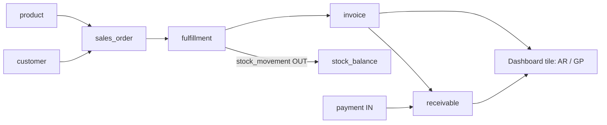
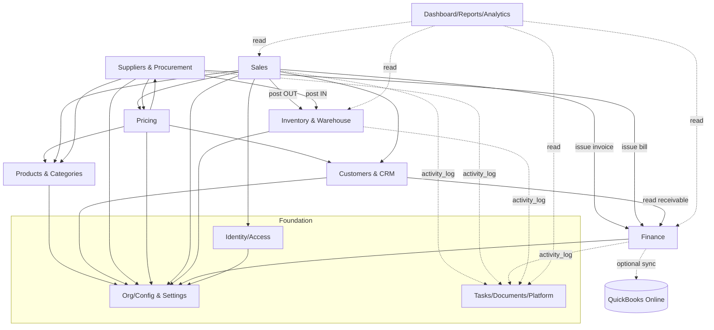

# ApexOS — Module Breakdown

> **Status:** Draft for build · **Owner:** Architecture · **Version:** 1.0 · **Date:** 2026-07-19
>
> Conforms to `00-canonical-foundation.md`. Entity names are canonical (§5); module map is §7.
> Where this document and the foundation disagree, **the foundation wins**.

---

## 0. How to read this

Each module below lists: **Purpose**, **Owns** (entities it is the write-authority for),
**Services** (business-logic verbs — the only place workflows live per D2), **Depends on**
(cross-module reads/calls), **Emits** (domain events written to `activity_log` per D10), and
**Phase** (D4 delivery wave).

Rules that bind every module:
- **Money** is integer minor units + `currency` (D5). **Keys** are UUID v7 (D6).
- **Audit + soft-delete** columns on every table (D7). **`business_unit_id`** on every
  operational table (D1).
- **Ledgers append, never mutate** (D3): `stock_movement`, `payment`, `invoice`, `bill`.
- **Every service verb that changes state writes one `activity_log` row** (D10) inside the
  same transaction as the state change.

### Module → entity ownership (canonical §5)

| Module | Owns |
|---|---|
| Org/Config & Settings | `business_unit`, `brand`, `category`, `procurement_model`, `uom`, `uom_conversion`, `customer_type`, `supplier_type`, `warehouse`, `tax_rate`, `setting` |
| Identity/Access | `user`, `role`, `permission`, `role_permission`, `user_role` |
| Products & Categories | `product`, `product_spec_attribute`, `product_barcode` |
| Customers & CRM | `customer`, `customer_contact`, `customer_address`, `customer_credit_policy`, `lead`, `opportunity`, `pipeline_stage`, `competitor` |
| Suppliers & Procurement | `supplier`, `supplier_contact`, `supplier_evaluation`, `purchase_order`, `purchase_order_line`, `goods_receipt`, `goods_receipt_line` |
| Pricing | `purchase_price`, `selling_price` |
| Sales | `sales_order`, `sales_order_line`, `fulfillment`, `fulfillment_line` |
| Inventory & Warehouse | `stock_movement`, `stock_balance` (derived) |
| Finance | `invoice`, `invoice_line`, `bill`, `bill_line`, `payment`, `payment_allocation`, `tax_line`, `receivable`/`payable` (derived) |
| Dashboard/Reports/Analytics | none (read-only projections) |
| Tasks/Documents/Platform | `activity_log`, `task`, `document`, `notification`, `decision_log`, `sop` |

> **Ownership = write authority.** Any module may *read* another's entities through its
> repository/service; only the owner *mutates*. `category` is owned by Org/Config even though
> Products reads it heavily; `stock_movement` is written only by Inventory, but Sales and
> Procurement *trigger* it through `InventoryService`.

---

## 1. The Spine (D4) — build this first, end to end

The Phase 1 vertical slice, production-quality before anything widens:

```
Customer → Product → SalesOrder → Fulfillment (stock move) → Invoice → Receivable → Dashboard tile
```



Spine service call-chain (the golden path):

```
SalesOrderService.create()      → activity: sales_order.created
SalesOrderService.confirm()     → activity: sales_order.confirmed
FulfillmentService.ship()       → InventoryService.post_movement(OUT)
                                  → activity: fulfillment.shipped, stock.moved
InvoiceService.issue()          → TaxService.compute(); activity: invoice.issued
                                  → (bridge) QuickBooksSyncService.push_invoice()  [optional]
PaymentService.record(IN)       → PaymentAllocationService.allocate(invoice)
                                  → activity: payment.recorded, invoice.settled
ReceivableProjection.refresh()  → Dashboard AR + GP tiles
```

Everything after Phase 1 is a **variation of this proven pattern** (Procurement mirrors Sales;
Bill mirrors Invoice; Payable mirrors Receivable).

---

## 2. Modules

### 2.1 Org/Config & Settings

- **Purpose:** System of record for the **data-driven nouns** (D2). Everything configurable
  from Settings — business units, brands, categories, UOMs and conversions, customer/supplier
  types, warehouses, GST slabs, and free-form `setting` key/values — lives here so workflows
  elsewhere stay code and these stay data.
- **Owns:** `business_unit`, `brand`, `category` (`→business_unit`, `→procurement_model`),
  `procurement_model`, `uom`, `uom_conversion`, `customer_type`, `supplier_type`, `warehouse`,
  `tax_rate`, `setting`.
- **Services:**
  - `BusinessUnitService.create/archive()`
  - `CategoryService.create/reparent()` — enforces the `→business_unit` rollup.
  - `UomConversionService.upsert()` — validates non-zero, non-cyclic factors (e.g. Case→Pack).
  - `TaxRateService.set_slab()` — versioned GST slabs; never edits history (D3 spirit).
  - `SettingService.get/set()` — typed read of `setting` with defaults.
- **Depends on:** nothing (root module). Everything depends on it.
- **Emits:** `business_unit.created`, `category.created`, `category.reparented`,
  `tax_rate.changed`, `setting.changed`.
- **Phase:** **Phase 1** (minimal seed: 1 business_unit, the 9 real categories, `uom` Pack/Roll,
  GST slabs, one `warehouse`). Full Settings UI → Phase 2.

### 2.2 Identity/Access

- **Purpose:** Own **authorization** even though authentication is delegated to Clerk (D8).
  Maps a verified Clerk session to our `user`, resolves roles → permissions, and is the guard
  every API route consults.
- **Owns:** `user`, `role`, `permission`, `role_permission`, `user_role`.
- **Services:**
  - `UserProvisioningService.sync_from_clerk()` — upsert `user` from a verified Clerk identity
    (idempotent on `clerk_user_id`).
  - `AuthorizationService.resolve_permissions(user)` — flattens `user_role → role_permission`
    into a permission set (cache later with Redis).
  - `AuthorizationService.require(permission)` — dependency used by every route.
  - `RoleService.assign/revoke()`.
- **Depends on:** Org/Config (`business_unit` for BU-scoped roles).
- **Emits:** `user.provisioned`, `role.assigned`, `role.revoked`, `permission.denied` (security
  trail).
- **Phase:** **Phase 1** (a handful of roles: Admin, Sales, Procurement, Finance, Viewer —
  enough to guard the spine).

### 2.3 Products & Categories

- **Purpose:** The SKU master. A `product` is the sellable/purchasable unit, keyed by human SKU
  `BRAND-CAT-SEQ` (e.g. `AUR-TIS-001`) plus a UUID PK (D6). Specs and barcodes hang off it.
- **Owns:** `product` (`→category`, `→brand`, `→uom`, `→procurement_model`),
  `product_spec_attribute`, `product_barcode`.
- **Services:**
  - `ProductService.create()` — generates SKU code from brand+category+sequence; validates the
    referenced data-nouns exist.
  - `ProductService.set_status()` — Active/Draft/Discontinued; respects `launch_phase`/priority.
  - `ProductSpecService.upsert()` — key/value spec attributes ("2 Ply", "19x21", "M Fold").
  - `BarcodeService.attach()`.
- **Depends on:** Org/Config (`category`, `brand`, `uom`, `procurement_model`).
- **Emits:** `product.created`, `product.status_changed`, `product.spec_changed`.
- **Phase:** **Phase 1** (needed by the spine — `Product` is the second node).

### 2.4 Customers & CRM

- **Purpose:** Buyers and the pipeline that creates them. Segmented by `customer_type` (never
  hardcoded to restaurants). Holds contacts, addresses, credit policy, and the pre-sale funnel
  (leads → opportunities → competitors).
- **Owns:** `customer` (`→customer_type`), `customer_contact`, `customer_address`,
  `customer_credit_policy` (`→customer`), `lead`, `opportunity`, `pipeline_stage`, `competitor`.
- **Services:**
  - `CustomerService.create/update()`.
  - `CreditPolicyService.set()` — credit limit, payment-term days, status; **versioned** history.
  - `CreditPolicyService.check(customer, order_total)` — the gate Sales calls at confirm.
  - `LeadService.convert()` — lead → customer, closing the opportunity.
  - `OpportunityService.advance(stage)`.
- **Depends on:** Org/Config (`customer_type`), Finance (reads `receivable` for
  live credit-exposure in `check()`).
- **Emits:** `customer.created`, `credit_policy.changed`, `lead.created`, `lead.converted`,
  `opportunity.stage_changed`.
- **Phase:** **Phase 1** for `customer` + `customer_credit_policy` (spine + credit gate).
  Leads/opportunities/competitors (CRM pipeline) → **Phase 2**.

### 2.5 Suppliers & Procurement

- **Purpose:** The buy side — supplier master, vendor scorecards, and the
  `Purchase Order → Goods Receipt (stock-in) → Bill` chain. Mirrors Sales structurally.
- **Owns:** `supplier` (`→supplier_type`), `supplier_contact`, `supplier_evaluation`,
  `purchase_order`, `purchase_order_line` (`→product`), `goods_receipt`, `goods_receipt_line`.
- **Services:**
  - `SupplierService.create/update()`.
  - `VendorEvaluationService.score()` — quality/price/reliability scorecard.
  - `PurchaseOrderService.create/confirm()` — snapshots `purchase_price` onto lines.
  - `GoodsReceiptService.receive()` — **emits `stock_movement` IN** via
    `InventoryService.post_movement()`; partial receipts allowed.
  - `BillService.enter()` — hands off to Finance (`BillService.issue()`).
- **Depends on:** Org/Config (`supplier_type`, `warehouse`), Products (`product`),
  Pricing (`purchase_price`), Inventory (post IN movement), Finance (bill).
- **Emits:** `supplier.created`, `supplier.evaluated`, `purchase_order.created`,
  `purchase_order.confirmed`, `goods_receipt.received`, `stock.moved`.
- **Phase:** **Phase 2** (the mirror slice, built after the Sales spine proves the pattern).

### 2.6 Pricing

- **Purpose:** Versioned buy and sell prices (D3 — append, never overwrite). `purchase_price`
  per SKU per supplier; `selling_price` per SKU, optionally per customer or per segment.
  Feeds **margin/GP**, the central KPI.
- **Owns:** `purchase_price` (`→product`, `→supplier`, `valid_from`, `price_minor`),
  `selling_price` (`→product`, `[→customer|→customer_type]`, `valid_from`, `price_minor`).
- **Services:**
  - `PurchasePriceService.set()` — new row with `valid_from`; supersedes by date, keeps history.
  - `SellingPriceService.set()` — same, with the customer/segment resolution order:
    customer-specific → segment → list.
  - `PricingService.resolve(product, customer, at)` — returns the effective price used when a
    `sales_order_line` / `purchase_order_line` is created.
  - `MarginService.gp(line)` — `selling − buying` per line and aggregated.
- **Depends on:** Products (`product`), Suppliers (`supplier`), Customers (`customer`,
  `customer_type`).
- **Emits:** `purchase_price.set`, `selling_price.set`.
- **Phase:** **Phase 1** for `selling_price.resolve()` (the spine prices its order lines).
  `purchase_price` + margin analytics → **Phase 2**.

### 2.7 Sales

- **Purpose:** The demand side of the spine. `Sales Order → Fulfillment (stock-out) → Invoice`.
  Orders capture intent and pricing; fulfillment turns them into a stock movement and an invoice.
- **Owns:** `sales_order` (`→customer`, `→business_unit`), `sales_order_line` (`→product`),
  `fulfillment` (`→sales_order`), `fulfillment_line`.
- **Services:**
  - `SalesOrderService.create()` — builds lines, calls `PricingService.resolve()` per line,
    computes tax preview via `TaxService`, assigns `SO-YYYYMM-#####`.
  - `SalesOrderService.confirm()` — **calls `CreditPolicyService.check()`**; on pass, moves to
    Confirmed and reserves nothing (stock is decremented at ship, not order — D3 keeps it simple).
  - `SalesOrderService.cancel()`.
  - `FulfillmentService.ship()` — creates `fulfillment` + lines, **emits one `stock_movement`
    per line (reason `SALE`, `ref_type=fulfillment`)** through `InventoryService.post_movement()`,
    then hands the shipped quantities to `InvoiceService.issue()`.
- **Depends on:** Customers (`customer`, credit check), Products (`product`), Pricing
  (`resolve`), Org/Config (`business_unit`, `tax_rate`), Inventory (post OUT movement),
  Finance (invoice issue).
- **Emits:** `sales_order.created`, `sales_order.confirmed`, `sales_order.cancelled`,
  `fulfillment.shipped`, `stock.moved`.
- **Phase:** **Phase 1** — core of the spine.

### 2.8 Inventory & Warehouse

- **Purpose:** The single append-only stock ledger. **No one writes stock directly** — Sales
  (ship OUT) and Procurement (receive IN) call `InventoryService`. Balances are **derived** from
  the `stock_movement` ledger per D3, never stored as a mutable number.
- **Owns:** `stock_movement` (`→product`, `→warehouse`, `qty_delta`, `reason`, `ref_type`,
  `ref_id`), `stock_balance` (materialized/derived per product per warehouse).
- **Services:**
  - `InventoryService.post_movement(product, warehouse, qty_delta, reason, ref)` — the only
    writer of `stock_movement`; one row per movement, sign encodes IN(+)/OUT(−).
  - `InventoryService.balance(product, warehouse)` — sum of `qty_delta` (or read the
    materialized `stock_balance`).
  - `StockAdjustmentService.adjust()` — manual correction with reason (`ADJUSTMENT`, `COUNT`).
  - `StockBalanceProjection.refresh()` — rebuilds/refreshes the derived `stock_balance`.
- **Depends on:** Org/Config (`warehouse`), Products (`product`). Called by Sales & Procurement.
- **Emits:** `stock.moved`, `stock.adjusted`.
- **Phase:** **Phase 1** for `post_movement` + `balance` (the spine's OUT movement + on-hand
  tile). Multi-warehouse transfers, cycle counts → **Phase 2**.

### 2.9 Finance

- **Purpose:** Append-only financial ledgers (D3). `invoice`/`bill` are issued documents;
  `payment` records cash in/out; `payment_allocation` links cash to documents; `receivable`
  and `payable` are **derived** (document total − allocated). GST via `tax_line`. This module is
  also the **QuickBooks Online integration boundary** (see §4).
- **Owns:** `invoice` (`→customer`, `→sales_order`), `invoice_line`, `bill` (`→supplier`,
  `→purchase_order`), `bill_line`, `payment` (`direction: in|out`, `→party`),
  `payment_allocation` (`→invoice|→bill`), `tax_line`, and the derived `receivable`/`payable`.
- **Services:**
  - `InvoiceService.issue()` — freezes lines from the fulfilled quantities, assigns
    `INV-YYYYMM-#####`, computes `tax_line` via `TaxService`, writes the immutable `invoice`.
  - `BillService.issue()` — supplier-side mirror from a goods receipt.
  - `PaymentService.record(direction, party, amount)` — append a `payment`.
  - `PaymentAllocationService.allocate(payment, [invoice|bill])` — link cash to documents;
    validates over-allocation.
  - `ReceivableProjection.for(customer)` / `PayableProjection.for(supplier)` — derived balances
    for Dashboard + credit checks.
  - `TaxService.compute(lines)` — GST-aware from day one, using `tax_rate` slabs.
  - `QuickBooksSyncService.push_invoice/push_bill/push_payment()` — **bridge only** (§4);
    behind a feature flag, non-blocking.
- **Depends on:** Sales (`sales_order`, fulfilled qty), Procurement (`purchase_order`, receipt),
  Customers/Suppliers (parties), Org/Config (`tax_rate`), QBO connector (optional bridge).
- **Emits:** `invoice.issued`, `bill.issued`, `payment.recorded`, `payment.allocated`,
  `invoice.settled`, `qbo.synced`.
- **Phase:** **Phase 1** for `invoice.issue` + `payment.record` + `receivable` (spine tail).
  Bills/payables, QBO bridge → **Phase 2**.

### 2.10 Dashboard / Reports / Analytics

- **Purpose:** Read-only command center. Answers the three page questions (§8 of the
  foundation): *What happened? · What needs attention? · What should I do?* Owns **no** entities —
  it projects over the ledgers and the `activity_log`.
- **Owns:** nothing (query/projection layer only).
- **Services:**
  - `ActivityFeedService.recent(scope)` — the "What happened?" feed from `activity_log`.
  - `DashboardService.spine_tiles()` — AR outstanding, GP this period, on-hand value, open
    orders — the Phase 1 tiles.
  - `KpiService.compute(kpi, period)` — margin, DSO, fill-rate, etc.
  - `ReportService.run(report, filters)` — tabular exports (CSV) over the ledgers.
- **Depends on:** **reads** Finance (receivable/GP), Inventory (on-hand), Sales (orders),
  Platform (`activity_log`). No writes.
- **Emits:** nothing (read-only; it does not mutate state, so no `activity_log` rows).
- **Phase:** **Phase 1** — the single AR/GP tile closes the spine. Full KPI board → Phase 3.

### 2.11 Tasks / Documents / Platform

- **Purpose:** Cross-cutting infrastructure every module leans on. `activity_log` is the D10
  event store; `task` is a to-do linkable to any entity; `document` is an R2 file linked to any
  entity; plus `notification`, `decision_log` (ADRs), `sop`.
- **Owns:** `activity_log`, `task`, `document`, `notification`, `decision_log`, `sop`.
- **Services:**
  - `ActivityLogService.record(actor, verb, entity, before, after)` — **called by every other
    service** inside its transaction (D10). This is the write path for all `*.emitted` events
    listed above.
  - `TaskService.create/complete()` — polymorphic `entity_type`/`entity_id` link.
  - `DocumentService.upload()` — stores to Cloudflare R2, records metadata, polymorphic link.
  - `NotificationService.push()`.
  - `DecisionLogService.record()` — ADR entries (feeds `20-decisions-log.md`).
- **Depends on:** Identity (actor = `user`), R2 (storage). Structurally depended on by everyone.
- **Emits:** `task.created`, `task.completed`, `document.uploaded`, `notification.sent`.
  (`ActivityLogService` is the sink, not an emitter of its own domain events.)
- **Phase:** **Phase 1** for `activity_log` + `ActivityLogService.record` (D10 is a spine
  requirement — the Dashboard feed depends on it). Tasks/Documents/Notifications → Phase 2.

---

## 3. Cross-module dependency graph

Arrows point **from dependent to dependency** ("A → B" = A calls/reads B). Ledger writes that
cross module boundaries are labelled.



**No cycles in the write graph.** The one bidirectional-looking edge (Customers reads Finance's
`receivable` for credit checks; Finance reads Customers for the invoice party) is a *read* in
both directions and a *write* in neither — safe.

---

## 4. Domain events → `activity_log` (D10)

Every state-changing service verb writes exactly one `activity_log` row in-transaction. Verb
naming is `<entity>.<past_tense>`. The Dashboard feed and audit both read this table.

| Module | Events |
|---|---|
| Org/Config | `business_unit.created`, `category.created`, `category.reparented`, `tax_rate.changed`, `setting.changed` |
| Identity | `user.provisioned`, `role.assigned`, `role.revoked`, `permission.denied` |
| Products | `product.created`, `product.status_changed`, `product.spec_changed` |
| Customers/CRM | `customer.created`, `credit_policy.changed`, `lead.created`, `lead.converted`, `opportunity.stage_changed` |
| Suppliers/Procurement | `supplier.created`, `supplier.evaluated`, `purchase_order.created`, `purchase_order.confirmed`, `goods_receipt.received` |
| Pricing | `purchase_price.set`, `selling_price.set` |
| Sales | `sales_order.created`, `sales_order.confirmed`, `sales_order.cancelled`, `fulfillment.shipped` |
| Inventory | `stock.moved`, `stock.adjusted` |
| Finance | `invoice.issued`, `bill.issued`, `payment.recorded`, `payment.allocated`, `invoice.settled`, `qbo.synced` |
| Platform | `task.created`, `task.completed`, `document.uploaded`, `notification.sent` |

`activity_log` row shape: `actor (user_id)`, `verb`, `entity_type`, `entity_id`,
`before (jsonb)`, `after (jsonb)`, `business_unit_id`, `created_at`.

---

## 5. Phase plan (D4)

| Phase | Scope | Modules involved |
|---|---|---|
| **Phase 1 — Spine** | `Customer → Product → SalesOrder → Fulfillment → Invoice → Receivable → Dashboard tile`, plus the minimum of each foundation module to support it | Org/Config (seed), Identity (roles), Products, Customers (customer + credit), Pricing (selling_price resolve), Sales, Inventory (post/ balance), Finance (invoice + payment + receivable), Platform (activity_log), Dashboard (AR/GP tile) |
| **Phase 2 — Buy side + widen** | Procurement mirror (`PO → GR → Bill → Payable`), Pricing history + margin, full Settings, Tasks/Documents, QBO bridge | Suppliers/Procurement, Pricing (full), Org/Config (full), Finance (bills/payables + QBO), Platform (tasks/docs) |
| **Phase 3 — Intelligence** | CRM pipeline (leads/opportunities/competitors), full KPI board, reports/analytics, notifications | Customers/CRM (pipeline), Dashboard/Reports/Analytics (full), Platform (notifications) |

Every Phase 2/3 module is a **restatement of a Phase 1 pattern**: Bill = Invoice, Payable =
Receivable, Goods Receipt = Fulfillment, Purchase Order = Sales Order. Build the spine once,
correctly; copy the shape thereafter.
