# ApexOS — Deployment Strategy

> **Status:** Approved · **Owner:** DevOps · **Version:** 1.0 · **Date:** 2026-07-19
>
> Conforms to `00-canonical-foundation.md`. Where this document and the foundation disagree,
> **the foundation wins**. This document defines how ApexOS is built, tested, migrated, deployed,
> observed, rolled out, and rolled back — from the Railway/Render start point to the Kubernetes
> future. Security of the pipeline (secrets, scanning, supply chain) is in `13-security-design.md`;
> data recovery is in `14-backup-strategy.md`.

---

## 1. Environments

Three isolated environments (isolation controls in `13-security-design.md` §10):

| Env | Purpose | Data | Deploy trigger | Access |
|---|---|---|---|---|
| **dev** | Feature work, PR previews | synthetic/seed | push to a PR/branch | whole team |
| **staging** | Pre-prod verification, migration rehearsal, DR game-days | anonymized/synthetic | merge to `main` | DevOps + QA |
| **prod** | Live business system | real business data | **tagged release + manual approval** | Founder/Admin + DevOps only |

- **One image, promoted.** The exact image tested in staging is the image released to prod — **only
  config/secrets differ per env** (§6). No per-env rebuilds.
- **Clerk, Postgres, and R2 are per-env** (separate instances/buckets/credentials) — no cross-env reuse.

---

## 2. Docker images (web + api + postgres)

Per `10-folder-structure.md`, Dockerfiles live in `docker/`. Three images/services:

| Image | Base | Build | Runtime |
|---|---|---|---|
| **web** | node slim → distroless/runtime | Next.js standalone build (multi-stage) | Node server; env-injected public/runtime config |
| **api** | python slim | multi-stage: deps layer (locked) → app; non-root user | Uvicorn/Gunicorn workers behind the edge |
| **postgres** | official `postgres` (pinned by digest) | — | Managed Postgres in dev/staging/prod; the image is for **local compose only** |

- **Multi-stage builds** keep runtime images minimal (smaller attack surface, faster pulls). Base images
  **pinned by digest**; images run as **non-root** (`13-security-design.md` §9).
- **Local dev** uses `docker/docker-compose.yml` (postgres + redis + api + web) — parity with prod
  topology.
- **Secrets are never baked in** — injected at runtime (§6, `13-security-design.md` §3).
- Images are built **only by CI** from a tagged commit, scanned (Trivy), SBOM-generated, and pushed to
  the registry — no local pushes.

---

## 3. CI/CD pipeline (GitHub Actions)

Stages run in `.github/workflows/` (`ci.yml` for PRs, `deploy.yml` for releases). The pipeline is
**lint → test → build → migrate → deploy**, with security gates woven in.

```mermaid
flowchart LR
    subgraph PR["ci.yml — on Pull Request"]
        A[Checkout] --> B[Install<br/>pnpm + uv, cached]
        B --> C[Lint & Typecheck<br/>eslint · ruff · tsc · mypy]
        C --> D[Test<br/>vitest · pytest<br/>ephemeral Postgres]
        D --> E[Security gates<br/>gitleaks · CodeQL<br/>pnpm/pip audit]
        E --> F[RBAC matrix diff-check<br/>matrix ↔ seed migration]
        F --> G[Build images<br/>web · api multi-stage]
        G --> H[Trivy scan + SBOM]
    end

    H --> M{Merge to main?}
    M -->|yes| N[Publish images<br/>to registry]

    subgraph DEPLOY["deploy.yml"]
        N --> O[Deploy → staging]
        O --> P[Alembic migrate<br/>forward-only]
        P --> Q[Smoke tests<br/>spine health]
        Q --> R{Tagged release<br/>+ approval?}
        R -->|yes| S[Deploy → prod<br/>rolling]
        S --> T[Alembic migrate<br/>zero-downtime]
        T --> U[Health checks<br/>+ error-rate watch]
        U -->|healthy| V[Release complete]
        U -->|unhealthy| W[Rollback<br/>previous image]
    end
```

**Stage detail:**

1. **Lint & typecheck** — ESLint + `tsc` (web), Ruff + mypy (api). Style/type errors block.
2. **Test** — Vitest (web), pytest (api) against an **ephemeral Postgres** service container; migrations
   applied first so tests run on the real schema. Coverage thresholds enforced.
3. **Security gates** — secret scan (gitleaks), SAST (CodeQL), dependency audit (`pnpm audit` /
   `pip-audit`). High/critical blocks (`13-security-design.md` §9).
4. **RBAC integrity** — CI **diff-checks the permission matrix (RBAC §4) against
   `seed_roles_permissions.py`**; any drift, or a permission code referenced in code but missing from
   the seed, is a **deploy-blocking error** (RBAC §7, `13-security-design.md` §2).
5. **Build** — multi-stage web + api images; **Trivy** image scan + SBOM (§2).
6. **Migrate** — Alembic runs as a **discrete pipeline step before app rollout** (§4), against staging
   then prod.
7. **Deploy** — staging automatically on merge; **prod only on a tagged release with manual approval**.

---

## 4. Alembic migration policy

- **Forward-only.** No `downgrade` in production — recovery is **roll forward** (a new corrective
  migration) or **restore** (`14-backup-strategy.md`), never a destructive down-migration on live data.
  This aligns with append-only ledgers (D3) and soft-delete (D7): we don't destroy data to revert.
- **Migrations are a distinct, ordered CI step** run **before** the new app image serves traffic — the
  schema is always ready for the code that assumes it.
- **Zero-downtime via expand/contract** (the rule for every schema change touching a live table):
  1. **Expand** — additive change (new nullable column / new table / new index built `CONCURRENTLY`).
     Deploy. Old and new code both work against it.
  2. **Migrate/backfill** — batched, online backfill of data; dual-write in app code if needed.
  3. **Contract** — a **later** release drops the old column/constraint once no running code references
     it.
  - Never rename/drop a column in the same release that stops using it. Never take a blocking lock or a
    long `ALTER` on a hot table; use `CONCURRENTLY` and batched updates.
- **Every schema change ships as a migration** — no manual DB edits. Migrations are reviewed like code.
- **Head-version pinning:** the deployed app records its expected Alembic head; a mismatch fails the
  health check and blocks/rolls back the release (`14-backup-strategy.md` §3.3).
- **Seed migrations** (e.g. `seed_roles_permissions.py`, the 9 real categories, GST slabs, UOMs) are
  idempotent and version-controlled (foundation §4, module breakdown Phase 1 seed).

---

## 5. Observability

Every page answers "What happened?" (foundation §8); the platform must answer it too.

| Signal | Tooling | Detail |
|---|---|---|
| **Logs** | Structured JSON logging (foundation §3) | Correlation/request id per call; **PII/secrets redacted** (`13` §4); shipped to a central log sink |
| **Metrics** | App + platform metrics | Latency, throughput, error rate, DB pool, queue depth; per-endpoint SLOs |
| **Health checks** | `/healthz` (liveness), `/readyz` (readiness) | `readyz` verifies DB connectivity **and Alembic head match** (§4); drives rollout gating |
| **Error tracking** | Sentry (or equiv.) | Exceptions with release tag + trace; alerts on new/spiking errors |
| **Audit feed** | `activity_log` (D10) | Business-event trail; also a security signal (`13` §5) |
| **Uptime** | External probe | Edge-level availability, alerting to on-call |

- **Alerting:** error-rate spike, health-check failure, missed/failed backup (`14` §4), repeated `403`
  / rate-limit trips (`13` §7) page DevOps.
- **Dashboards:** golden signals (latency, traffic, errors, saturation) + business KPIs surfaced from
  the app's own Dashboard tiles.

---

## 6. Configuration & secrets per environment

- **12-factor config:** all config via **environment variables**; `.env.example` documents every var
  with no values (`10-folder-structure.md`).
- **Secrets** live in the platform secret store (Railway/Render env vars → K8s Secrets / External
  Secrets Operator later), **injected at runtime**, never in the image or repo (`13` §3).
- **Per-env separation:** dev/staging/prod each hold distinct Clerk keys, Postgres DSN, R2 tokens, QBO
  credentials (`13` §10). CI deploy tokens are **environment-scoped** GitHub Actions secrets.
- **Config drift control:** the set of required vars is validated at boot (fail-fast if a required
  secret is missing) so a misconfigured env never silently half-starts.

---

## 7. Rollout & rollback

- **Rollout strategy:** **rolling deploy** with health-gated readiness (`/readyz`). New instances must
  pass health + Alembic-head checks before receiving traffic; old instances drain gracefully.
  Canary/percentage rollout is adopted once on Kubernetes (§8).
- **Migration-safe ordering:** expand/contract (§4) guarantees old and new app versions coexist during
  the roll, so a rolling deploy never breaks on schema.
- **Rollback:** because images are immutable and promoted, rollback = **redeploy the previous image
  tag** (fast, deterministic). **Schema is *not* rolled back** (forward-only, §4) — expand/contract
  ensures the previous image still runs against the newer schema. If data integrity is implicated,
  escalate to restore (`14-backup-strategy.md`).
- **Release tagging:** prod releases are Git tags; the running release tag is exposed via `/healthz` and
  in error-tracking, so the deployed version is always identifiable.
- **Approval gate:** prod deploys require manual approval (§1) — the human check before real business
  data is touched.

---

## 8. Railway/Render → Kubernetes path

Deploy target evolves without changing the app (foundation §3 "Docker → Railway/Render → K8s later"):

| Stage | Platform | Rationale |
|---|---|---|
| **Now (Phase 1–2)** | **Railway/Render** | Managed Postgres, easy env/secret management, fast to prod — matches spine-first delivery (D4). Same Docker images. |
| **Scale (later)** | **Kubernetes** | When traffic/HA/multi-service needs (Redis, workers, QBO sync) justify it. |

- **The images don't change** — only orchestration does; `infra/` already reserves K8s manifests
  (`10-folder-structure.md`).
- **On K8s we gain:** HPA autoscaling, canary/blue-green rollouts, `Deployment` rolling updates, managed
  Postgres or an operator (CloudNativePG) with volume snapshots feeding `14`'s backup tiers, External
  Secrets Operator for §6, and network policies for `13` isolation.
- **Migration job as a K8s `Job`/init-container** runs before the rollout (§4), preserving the same
  "migrate before serve" ordering.
- **Redis** (foundation §3, `16-future-roadmap.md`) slots in as a K8s service for rate-limiting (`13`
  §7) and caching — treated as ephemeral (`14` §5), not backed up.

---

## 9. Deployment checklist (per release)

- [ ] CI green: lint, typecheck, tests, security gates, **RBAC matrix diff** (§3).
- [ ] Images built by CI, scanned, SBOM attached; previous tag known for rollback (§7).
- [ ] Migrations follow forward-only + expand/contract; reviewed (§4).
- [ ] Staging deployed, migrated, smoke-tested; DR/backups healthy (`14`).
- [ ] Prod deploy is a tagged release with manual approval (§1).
- [ ] `/readyz` (DB + Alembic head) green post-deploy; error rate flat (§5).
- [ ] Rollback path confirmed (previous image tag deployable).
