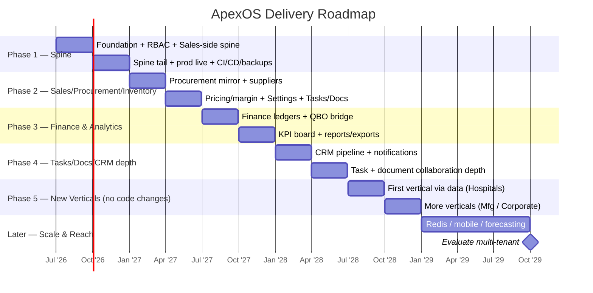

# ApexOS — Future Roadmap

> **Status:** Approved · **Owner:** Founder + Architecture · **Version:** 1.0 · **Date:** 2026-07-19
>
> Conforms to `00-canonical-foundation.md`. Where this document and the foundation disagree,
> **the foundation wins**. This is the sequenced build plan for ApexOS. It ties directly to the
> founder's **Sheet 21 — Roadmap** (foundation §7, `Apex_Operating_System_Master_v1.xlsx`) and to
> the phase plan in `08-module-breakdown.md` §5. It is directional, not a contract — dates shift;
> **sequence and the spine-first principle (D4) do not.**

---

## 0. Guiding principles (why the order is the order)

- **Spine-first (D4).** One vertical slice —
  `Customer → Product → Sales Order → Fulfillment → Invoice → Receivable → Dashboard tile` — reaches
  production quality **before anything widens**. Every later module is a *variation of this proven
  pattern* (`08-module-breakdown.md` §5: Bill = Invoice, Payable = Receivable, PO = SO).
- **Data-drive the nouns, code the verbs (D2).** New customer types, categories, UOMs, procurement
  models are **rows**, not releases. This is what lets **Phase 5 add whole verticals with no code
  changes** — the single most important strategic property of the system.
- **Nothing hardcoded to restaurants** (foundation §1). HoReCa is the *first* market, not the *only*
  one — the model is built vertical-agnostic from day one.
- **Earn complexity.** Redis, mobile, forecasting, and possible multi-tenant (D1's reserved option)
  arrive only when a real need proves them — not speculatively.

---

## 1. Phase overview

| Phase | Theme | Outcome | Maps to |
|---|---|---|---|
| **Phase 1** | **The Spine** | One end-to-end slice in production; architecture proven with real code | 08 §5 Phase 1; D4 |
| **Phase 2** | **Full Sales / Procurement / Inventory** | Buy-side mirror + widen operations; full Settings, Tasks/Docs | 08 §5 Phase 2 |
| **Phase 3** | **Finance & Analytics** | Full finance ledgers, QBO bridge depth, KPI board, reports | 08 §5 Phase 3 |
| **Phase 4** | **Tasks / Docs / CRM depth** | Pipeline, collaboration, document workflows mature | 08 §5 Phase 3 (extended) |
| **Phase 5** | **New verticals** | Hospitals, Manufacturing, Corporate, etc. — **via data, no code changes** | foundation §1 (future markets); D2 |
| **Later** | **Scale & reach** | Redis, mobile, forecasting, possible multi-tenant | foundation §3; D1 |

---

## 2. Phase detail

### Phase 1 — The Spine
**Goal:** prove the whole architecture with a single production-quality vertical slice.

- **Ships:** minimal seed (1 `business_unit`, the 9 real categories, `uom` Pack/Roll, GST slabs, one
  `warehouse`); core roles (Admin, Sales, Procurement, Finance, Viewer); `product`; `customer` +
  `customer_credit_policy`; `selling_price.resolve()`; `sales_order` → `fulfillment` (stock-out);
  `invoice.issue` → `payment` → `receivable`; `activity_log` (D10); the AR/GP Dashboard tile.
- **Non-negotiables from foundation:** money as minor units (D5), UUID v7 (D6), audit + soft-delete
  (D7), append-only ledgers (D3), BU dimension (D1), RBAC + threshold approvals
  (`03-user-roles-and-permissions.md`).
- **Exit criteria:** a real order flows end-to-end to a receivable and a dashboard tile, on prod, under
  RBAC, backed up (`14`) and observable (`15`).

### Phase 2 — Full Sales / Procurement / Inventory
**Goal:** complete the operational core; the **buy-side mirror** of the spine.

- **Ships:** Procurement mirror `Purchase Order → Goods Receipt → Bill → Payable`; suppliers +
  `supplier_evaluation`; pricing **history + margin** analytics (`purchase_price`, versioned per
  foundation §4); multi-warehouse moves, stock adjustments, cycle counts; **full Settings UI** (all
  data-driven masters editable, D2); Tasks & Documents (R2) surfaces.
- **Why now:** it's the same proven pattern restated (08 §5) — fastest, safest widening.

### Phase 3 — Finance & Analytics
**Goal:** close the financial loop and turn data into decisions.

- **Ships:** full finance ledgers (bills/payables, payment allocations, tax lines); **QuickBooks Online
  bridge** as candidate system-of-record for Finance (foundation §3, `quickbooks.sync` RBAC §4); full
  **KPI board** (foundation §7 sheets 18/19) — margin/GP, AR aging, sales/procurement analytics;
  reports + exports (gated by `report.export`/`finance.export`).
- **Why now:** operations generate the data in Phases 1–2; analytics needs that history to be worth
  building.

### Phase 4 — Tasks / Docs / CRM depth
**Goal:** deepen the command-center and pipeline.

- **Ships:** CRM pipeline (`lead`/`opportunity`/`pipeline_stage`/`competitor`, foundation §5; sheets
  12/13/16); notifications; richer task workflows and document collaboration/versioning; the full
  "What needs attention? / What should I do?" experience (foundation §8).
- **Why now:** with operations + finance live, the org's attention-management and growth surfaces pay
  off most.

### Phase 5 — New verticals (the strategic payoff)
**Goal:** enter **Hospitals, Manufacturing, Corporate Offices, Educational Institutions, Facility
Management, Industrial** (foundation §1) **without code changes**.

- **How:** each new market is expressed as **data** (D2) — new `customer_type`/segment, categories,
  UOMs, procurement models, tax handling, price lists, and a new `business_unit` (D1). No hardcoded
  restaurant assumptions means the same workflows just work.
- **Ships:** vertical onboarding playbooks, per-vertical dashboards/reports (config-driven), any
  genuinely-new *workflow* variant promoted from code→config only when a second real variant appears
  (D2).
- **Why this is the whole point:** the up-front discipline of D1/D2 turns market expansion from a
  re-build into a **configuration exercise** — the roadmap's compounding return.

### Later — Scale & reach
Adopted **only when a real need proves them** (foundation §3, D1):

- **Redis** — caching + rate limiting (`13` §7) + queues/background workers (QBO sync, backfills). Slots
  in as a service (`15` §8); treated as ephemeral (`14` §5).
- **Mobile** — warehouse/field-facing app (fulfillment, goods receipt, stock) reusing the same API.
- **Forecasting / intelligence** — demand forecasting, reorder suggestions, margin optimization, built
  on the append-only history accumulated since Phase 1.
- **Possible multi-tenant** — D1 kept `business_unit` first-class precisely to preserve this option; a
  genuine second tenant (or productization) would promote BU-scoping to full tenant isolation.

---

## 3. Quarter-by-quarter plan

Anchored to the current date (2026-07-19 → **Q3 2026**). Directional; sequence is fixed, dates flex.

| Quarter | Phase focus | Key deliverables |
|---|---|---|
| **Q3 2026** | Phase 1 | Foundation seed, RBAC, spine build start: Customer · Product · Sales Order |
| **Q4 2026** | Phase 1 | Spine tail: Fulfillment → Invoice → Receivable → Dashboard tile; **prod live**; backups + CI/CD (`14`,`15`) |
| **Q1 2027** | Phase 2 | Procurement mirror (PO → GR → Bill → Payable); suppliers + evaluation |
| **Q2 2027** | Phase 2 | Pricing history + margin; multi-warehouse/adjustments; **full Settings UI**; Tasks/Docs |
| **Q3 2027** | Phase 3 | Full finance ledgers; **QBO bridge**; tax lines |
| **Q4 2027** | Phase 3 | **KPI board** (sheets 18/19); reports + gated exports |
| **Q1 2028** | Phase 4 | CRM pipeline (leads/opportunities/competitors); notifications |
| **Q2 2028** | Phase 4 | Task workflows + document collaboration depth |
| **Q3 2028** | Phase 5 | First **new vertical** onboarded via data only (e.g. Hospitals); per-vertical config dashboards |
| **Q4 2028** | Phase 5 | Additional verticals (Manufacturing / Corporate); onboarding playbooks |
| **2029+** | Later | Redis; mobile; forecasting; evaluate multi-tenant |

---

## 4. Timeline (Gantt)

---

## 5. Traceability to Sheet 21 (Roadmap) and the docs

- **Sheet 21 — Roadmap** (foundation §7) is the founder's source; this document sequences its intent
  into build phases and quarters.
- **`08-module-breakdown.md` §5** defines Phases 1–3 at the module level; Phases 4–5 and Later extend it
  here.
- Each phase inherits the locked decisions (D1–D10) and the RBAC/security/backup/deploy guarantees in
  `03`, `13`, `14`, `15`. **New markets are data (D2), not forks** — that is the roadmap's core bet.
- Roadmap changes are logged as ADRs in `20-decisions-log.md` (foundation intro).
